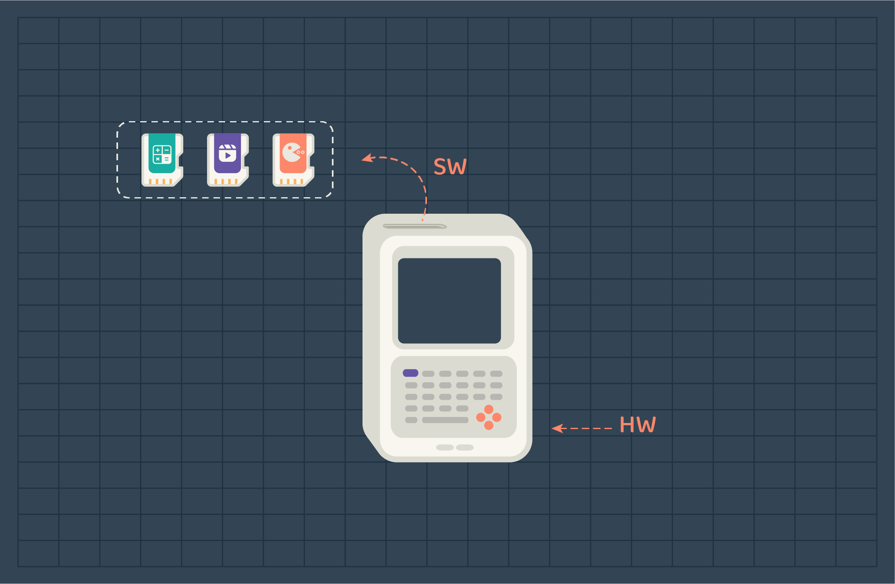

## Introduction

Have you ever thought about how computers work? Or what do they consist of? 
In general, computers consist of 2 main components. Hardware and software. 

You can think of the hardware as the body of the computer, it contains several resources that are used to act. While the software is the thoughts, functions, or tasks that drive the body(HW) to work to achieve or complete a task. 

In the early phases of computer development, computers were used to do a single task at a time. For each task/job, people had to wait several hours for the computer to finish to insert the second job. 

> A **job** is a program or a collection of programs that are used to perform a task.

And to manage these jobs a specialized employee was assigned. The task of gathering, executing, and delivering the job outputs was the operator's responsibility. Most of the time, operators were preparing and inserting jobs, waiting for it to finish, and tearing the output paper from the printer to deliver the output to users.
A lot of time was wasted on repeatable and time-consuming tasks the operator performed. Since then, the companies that were constructing computer devices started to work on solutions that would reduce the cost of wasted time and money. After several tries and computer series production that appeared at the time, an operating system was developed. At first, its job was to handle several input programs/jobs by taking a group of jobs (not only one as before) and executing the first one, if the job finishes the operating system will directly look for the second job to execute and continue until the last job finishes. 

## Perspective

Here is how actual computers in its early stages work, the software needs to be merged with the hardware so the device can start working. When the software is mounted, the device becomes a whole, it can be a calculator, video player, or game player. Depending on the software that was mounted, the device identity is determined. 

> The device functionality is determined by the software it runs.

The previous image represents the actual representation of early computers. But, if we look differentially at the concept, we will find that the logical representation of the computer system is just as hardware that is missing a piece which is the software to be a complete computer system that runs and performs an action. 

Computer systems now can hold several different programs and run them. You don’t have to mount and unmount the software manually. This is achieved using an operating system. 
Now, before jumping to the operating system concept, what do you think will happen if you stuffed two or more software in the hardware?

No matter what your answer was, we agree that the device won’t work as expected. Programs won’t do their expected jobs. Each program will try to dominate the hardware to complete its job.

Let us take a second example, this one is a real-life case. 

### Real-life Example
In a team of A, B, and C, each has his own tasks to complete, but to do so they need some resources. 

- Calculator
- Writer 
- Printer 

A, have a problem to solve, write the solution and then print it: calculator -> writer -> printer.

B, have a ready-made document that needs to be printed: printer.

C, have a solution to write as a document and then print it: writer -> printer. 

In this case, the team leader/office manager should manage the use of resources by assigning each member to a resource. 

- Calculator: A
- Writer: C
- Printer: B

If C is done, he can wait for B and then use the printer once it is available. 

If A is done, he can use the writer after C. 

If A is also done from using the writer, he will line up after C to use the printer.

Once B is done, the control of the printer will be given to C.

The team leader can decide if C or A should use the printer based on the strategy he follows. If based on priority, A might use the printer first if he has a higher priority task.
If based on who came first, C should use the printer first.

If you noticed, the team leader is the one to decide who can use what. He has a higher privilege by allocating resources to team members, while team members only request access to the resources.
In this case, the team leader is the **Operating System** while team members are **software programs**.
Both the team lead and team members are software but one has more privilege than the others.

If we had the same example with only one team member (one software), we wouldn’t need any resource allocation or management since all resources are free to be used and belong to that member. 
We conclude from the second case that some devices/resources might not need an OS to manage them. Your hand calculator, video player, or any other device that is responsible for doing one job does not need an operating system. Since it has all the resources for itself.

### Logical Perspective of Computer System
When an operating system is used, it will be a mediator between the hardware and the software, so it can manage any request from the programs. Therefore, its representation is going to be as the following. 

Notice that the operating system acts as a mediator between the hardware and the software.

Same structure can be applied with our real-life example. 

[image of the same structure but different namings. os -> team leader. hw-> resources. sw-> team members]

## Operating System Purpose 

Top-Down: Provide simple APIs for software to use. 
Button-up: Manages resources and schedules their usage.

## Conclusion 
This document was just an introduction to the operating system concept. We have covered the evolution of operating systems which is relatively connected to the evolution of computer devices. 
In the next topics, we will cover how operating systems manage programs and allocate the hardware resources to insure their execution.
