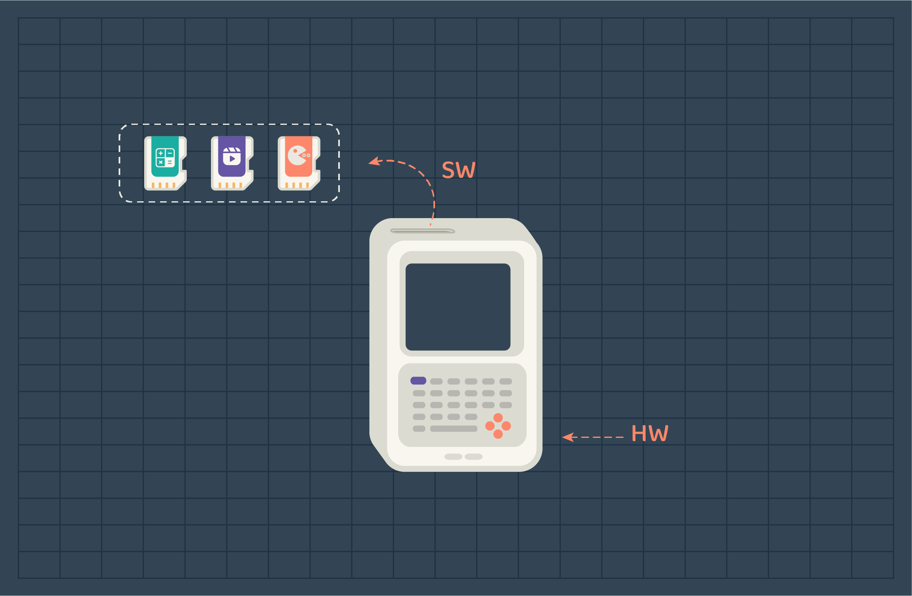
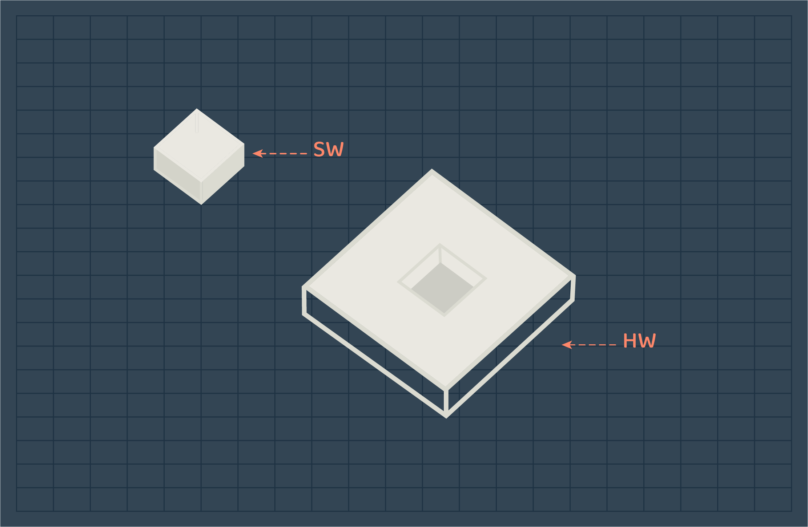
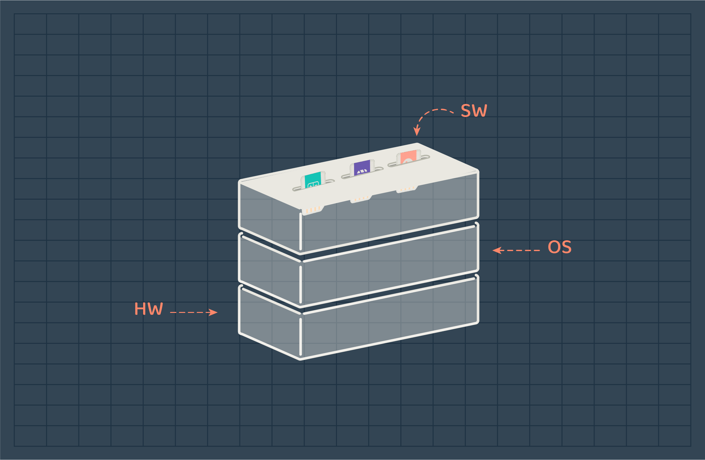

## Introduction

Have you ever thought about how computers work? Or what do they consist of? 
In general, computers consist of 2 main components. Hardware and software. 

You can think of the hardware as the body of the computer, it contains several resources that are used to act. While the software is the thoughts, functions, or tasks that drive the body(HW) to work to achieve or complete a task. 

In the early phases of computer development, computers were used to do a single task at a time. For each task/job, people had to wait several hours for the computer to finish to insert the second job. 

> A **job** is a program or a collection of programs that are used to perform a task.

And to manage these jobs a specialized employee was assigned. The task of gathering, executing, and delivering the job outputs was the operator's responsibility. Most of the time, operators were preparing and inserting jobs, waiting for it to finish, and tearing the output paper from the printer to deliver the output to users.
A lot of time was wasted on repeatable and time-consuming tasks the operator performed. Since then, the companies that were constructing computer devices started to work on solutions that would reduce the cost of wasted time and money. After several tries and computer series production that appeared at the time, an operating system was developed. At first, its job was to handle several input programs/jobs by taking a group of jobs (not only one as before) and executing the first one, if the job finishes the operating system will directly look for the second job to execute and continue until the last job finishes. 

## Perspective

Here is how actual computers work, the software needs to be merged with the hardware so the device can start working. When the software is mounted, the device becomes a whole, it can be a calculator, video player, or game player. 

