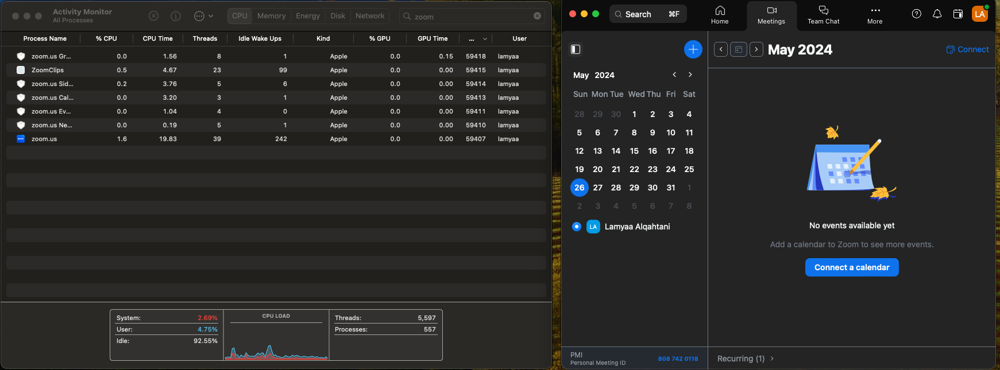
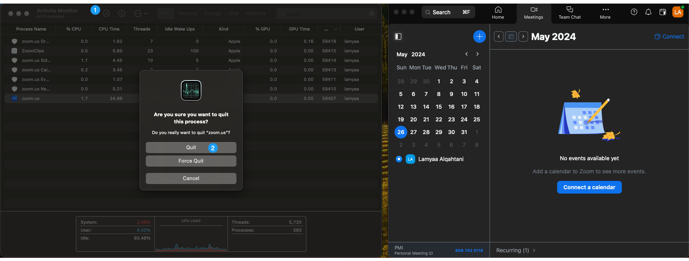
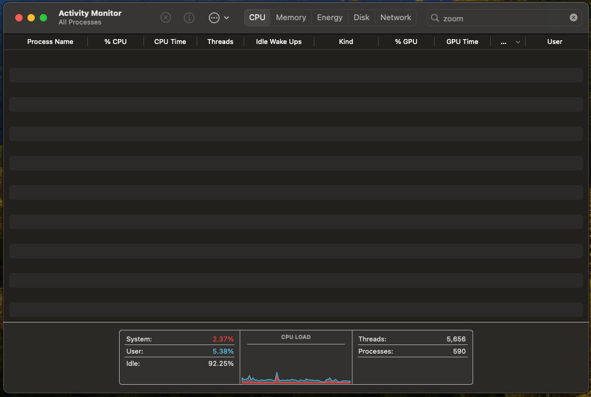

# Process 


## Concept
As described earlier, a `process` is a program in execution. That means when a program is at run time, the program becomes a process. However, what is a program called before that? 

Program passes through 3 phases in its lifetime which are as follows:
1. Development phase: Source code.
2. Compile phase: executable file. 
3. Run-time phase: a process.

[Image of a program in the three phases]

When a program is executed, it is loaded in main memory as a process to be handled by the operating system, from execution to assigning resources. Once the process completed its task, the operating system will free located memory addresses and resources from its use.

### Process Viewer 
Let us have a look at Activity Manager program on MacOS. It is a program that displays an overall status of running programs (processes) and their execution. Let us search for Zoom as an example while running it. 



As you can see, Zoom exists as a process since it is currently running. If we terminated the process by clicking on zoom and choosing quit, the zoom process will terminate and zoom will no longer be running. 



> If you are using windows, use Task manager program.
### Process States 
Once the program is loaded into memory and become a process, it will have one of the following states.

process states:
- **New** - The process is being created.
- **Ready** - The process is ready to be executed.
- **Running** - The CPU is working on this process's instructions.
- **Waiting** - The process can not run at the current time since it is waiting for an event or a resource to become available.
- **Terminated** - The process has finished.


### Process Tree
Every process is part of another process. If a running program (process) executed another program, the first one will be the parent of the second one. Processes relationship forms a tree data structure.

[example of the shell when running date program ]

## Code 
### Create a Process

Create a program that runs the `date` process and display its output.
```java
import java.io.BufferedReader;
import java.io.InputStreamReader;
import java.lang.Process;
import java.lang.ProcessBuilder;

public class Main {

    public static void main(String[] args) {
        try {

            Process p = new ProcessBuilder("date").start(); //Create a process to run date program
            BufferedReader bfr = new BufferedReader(new InputStreamReader(p.getInputStream())); //Read the process output data as an input
            String line = bfr.readLine();
            while (line  != null) { //Loop through the process output and print it until it is finished
                System.out.println(line);
                line = bfr.readLine();
            }
            System.out.println(p.exitValue());
            
        } catch (Exception e) {
            e.printStackTrace();
        }

    }
    
}

```

### Read a Process

```java
import java.io.BufferedReader;
import java.io.InputStreamReader;
import java.lang.Process;
import java.lang.ProcessBuilder;

// Get the information of date process.
public class ProcessInfo {

    public static void main(String[] args) {
        try {

            Process p = new ProcessBuilder("date").start(); //Create a process to run date program
            BufferedReader bfr = new BufferedReader(new InputStreamReader(p.getInputStream())); //Read the process output data as an input
            String line = bfr.readLine();
            while (line  != null) { //Loop through the process output and print it until it is finished
                System.out.println(line);
                line = bfr.readLine();
            }
            System.out.println(p.pid());
            System.out.println(p.isAlive());
            System.out.println(p.exitValue());

        } catch (Exception e) {
            e.printStackTrace();
        }

    }
    
}

```

### Terminate a Process

```java
import java.io.BufferedReader;
import java.io.InputStreamReader;
import java.lang.Process;
import java.lang.ProcessBuilder;

// Terminate a process using destroy method.
public class ProcessTerminate {

    public static void main(String[] args) {
        try {

            Process p = new ProcessBuilder("java", "--version").start(); //Create a process to run date program
            BufferedReader bfr = new BufferedReader(new InputStreamReader(p.getInputStream())); //Read the process output data as an input
            String line = bfr.readLine();
            while (line  != null) { //Loop through the process output and print it until it is finished
                System.out.println(line);
                line = bfr.readLine();
            }
            System.out.println(p.pid());
            System.out.println("Is alive before termination: " + p.isAlive());
            p.destroy();
            System.out.println("Is alive after termination: " + p.isAlive());
            System.out.println(p.exitValue());

        } catch (Exception e) {
            e.printStackTrace();
        }

    }
    
}

```


## Resources
- [Oracle docs: Class ProcessBuilder](https://docs.oracle.com/javase/8/docs/api/java/lang/ProcessBuilder.html)
- [Baeldung: Guide to java.lang.ProcessBuilder API](https://www.baeldung.com/java-lang-processbuilder-api)
- [MacOS activity monitor](https://support.apple.com/en-sa/guide/activity-monitor/actmntr1001/mac)
- 