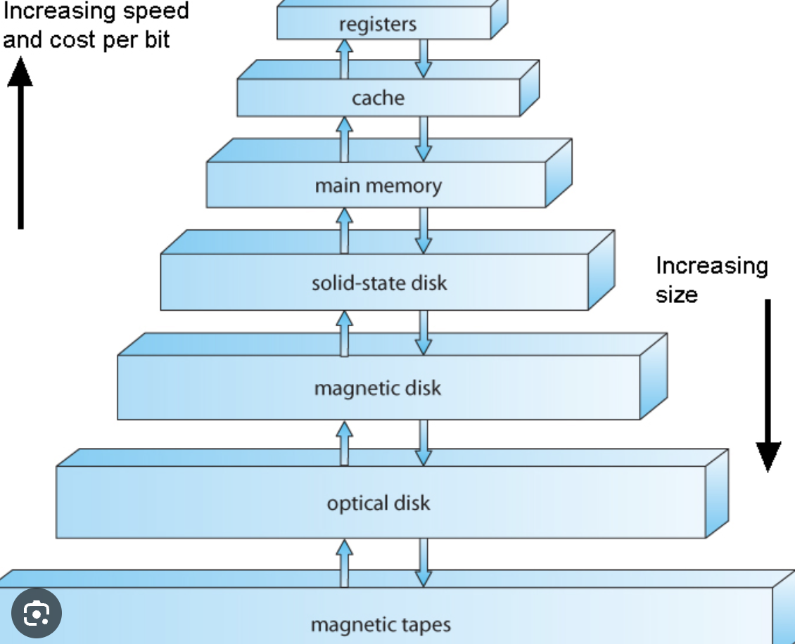
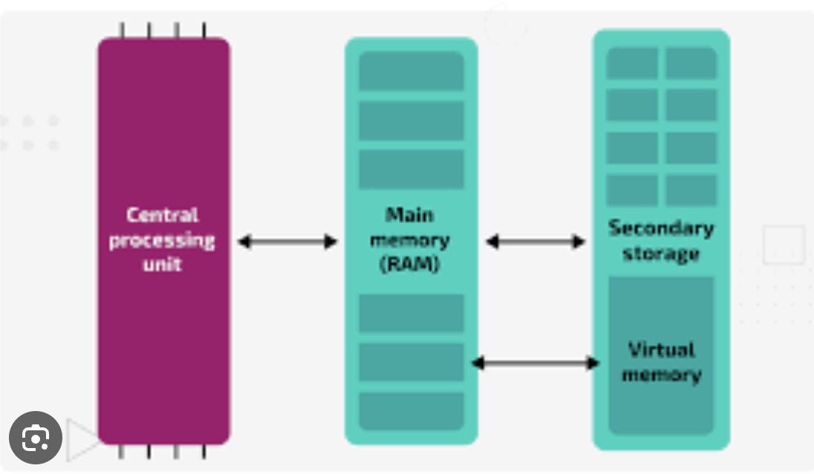
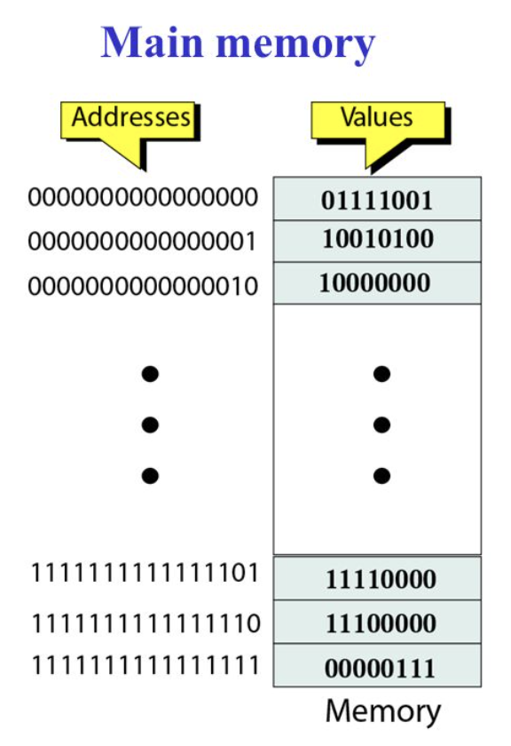

# Memory Management 
<!-- Memory is an essential part in the computer since it is where the OS load the programs for the CPU to execute. -->

Computers are used to process data, and these data does not come from thin air. It is stored in a special component of the computer which is the **Memory**. 

Memories comes in different sizes and types. There are what we call Random Access Memory (RAM) which stores data temporarily and Read Only Memory (ROM) which stores data permanently. 

> Note: The CPU also has a small memory that stores some data it needs for the processing. These are called registers.

## Memory Types and Usage

### Random Access Memory
RAM aka. **Main Memory** is the memory that the CPU access directly. It is faster than ROM but smaller in size.

Operating system uses main memory to store/load programs into it as processes for the CPU to execute. Once it is loaded and ready for execution, the CPU will read the process data from main memory directly and execute it. In another word, Main memory is used to store data that you are currently working on.

Once the process finish its execution, the Operating System will free the space for another process.

One more thing to note, is that main memory is volatile. Which means once we shut down the computer or cut the power from the memory all data in it will be lost.

#### How Main memory looks like
Main memory is a sequence of spaces and addresses that refers to each space.

### Read Only Memory
ROM is used to store permanent data that we don't want to loose when cutting of the power or shutting down the computer. Hence, it is non-volatile storage. 

In a case you updated a file but did not save the new update to it. What do you think will happen if your computer power when off suddenly?

The answer is your update won't be saved in the file since it is stored in main memory which is volatile. But in case you hit the save button before power turned off the update will be stored permanently in the ROM and won't be lost. 
