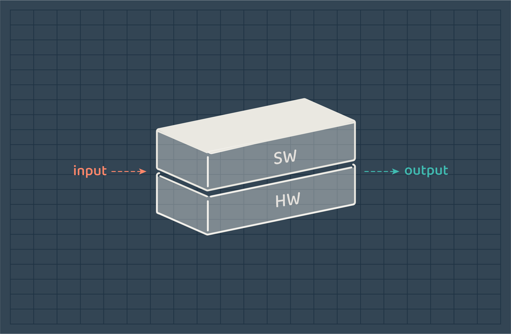
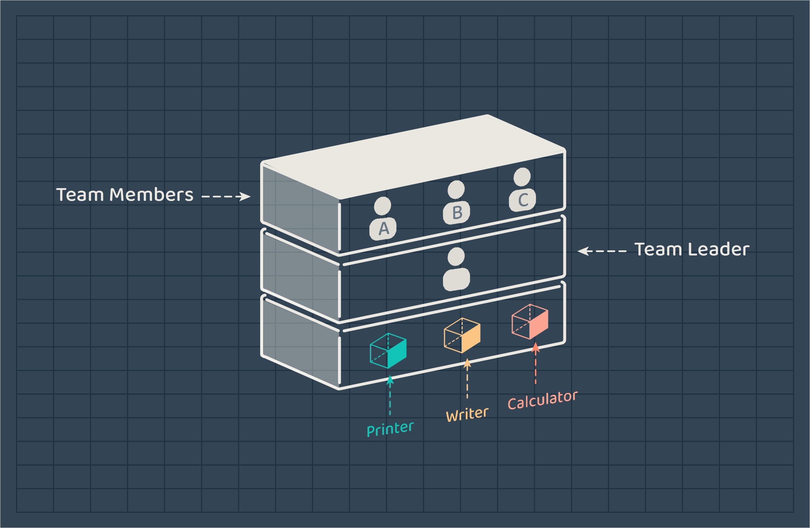
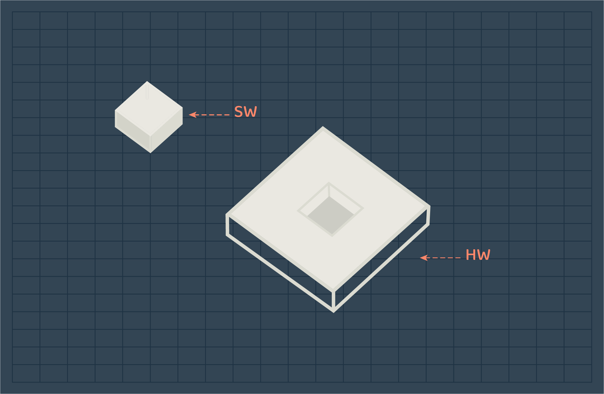
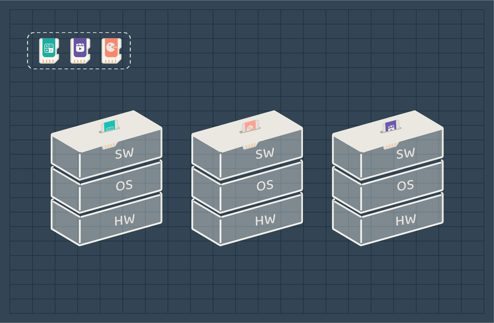
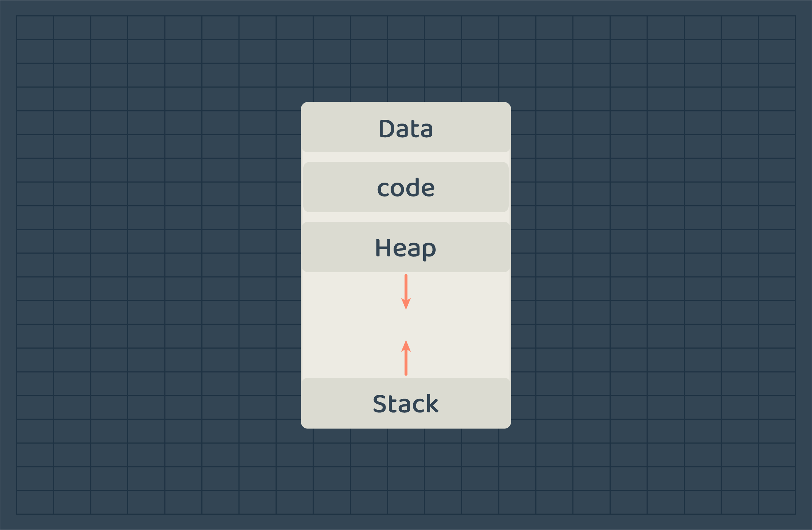

# Introduction

## Concept
`Operating System` is widely known as a system software that manages both hardware and software resources of a computer. 

But as you can notice, the definition is lacking the information of what is a software, hardware, and system software. Does that mean there are different types of software programs? 
That is why we want to change our view of the operating system to make it more concrete and clearer by explaining each point individually.

### Computer System
Operating system is a part of a computer system, that is why it is important to understand what is a computer.

Computers were created to manipulate data by performing an action on inputs and produce an output. Hence, we can think of a computer as a black-box that accepts an input and produces an output.

This black-box consist of two gross components that is necessary for it to perform it's job, which are the software and hardware. 

You can think of the hardware as the body of the computer, it contains several physical resources that are used to act. While the software is the functions or tasks that drive the body(HW) to work to achieve or complete a task. 

In the early phases of computer development, computers were used to do a single task at a time. For each task/job, people had to wait several hours for the computer to finish to insert the second job. 

> A **job** is a program or a collection of programs that are used to perform a task.

And to manage these jobs a specialized employee was assigned. The task of gathering, executing, and delivering the job outputs was the operator's responsibility. Most of the time, operators were preparing and inserting jobs, waiting for it to finish, and tearing the output paper to be delivered to users.
A lot of time was wasted on repeatable and time-consuming tasks the operator performed. Since then, the companies that were constructing computer devices started to work on solutions that would reduce the cost of wasted time and money. After several tries and computer series production that appeared at the time, an operating system was developed. At first, its job was to handle several input programs/jobs by taking a group of jobs (not only one as before) and executing the first one, if the job finishes the operating system will directly look for the second job to execute and continue until the last job finishes. But now, operating systems have evolved to execute several programs at the same time with a high utilization of hardware resources. 

### Software
Software (aka. program) is a set of instruction that drives the hardware to perform. Sometimes software programs are categorized into *System software* and *Application software*. Both are fundamentally the same, but they are used for different purposes. 

**Application Software**
It is the common type of software programs. Application software are written for normal users to perform their tasks. For example, games and text editors.

**System Software**
System software are written for the system to enable it to perform its job and help application software to do their intended tasks. For example, compilers and operating systems.

### Hardware 
Hardware refers to the physical resources in a computer. It contains the resources needed by the computer to perform. The essential hardware resources are the following,
- **CPU**: aka. processor, is responsible for executing instructions.
- **Main Memory**: used for storing data temporarily. 
- **Disk**: used for storing data permanently. 
- **I/O devices**: used to get inputs from users and produce outputs.

### Operating System
Now we know the key concepts of computer systems, we can deep dive into the operating system and its purpose. 

Once again, `Operating system` is a system software since it is written to manage the operating of a computer system. By managing the hardware resources allocations to programs and providing software programs with a simple APIs or services to access hardware resources. 

<!-- If not for the operating system, we would have needed to study and understand each hardware component we want to communicate with. But luckily, operating systems give us a set of services to request what we need to do and send the request to the hardware resource to be performed.  -->

Lets take a real-life example to map the concepts we covered, 

----
In a team of A, B, and C, each has his own tasks to complete, but to do so they need some resources. 

- **Calculator**: to calculate a mathematical operation.
- **Writer**: to write the result in a document.
- **Printer**: to print a document.

A, have a problem to solve, write the solution and then print it.
> **A** needs: calculator -> writer -> printer.

B, have a ready-made document that needs to be printed.
> **B** needs: printer.

C, have a solution to write as a document and then print it. 
> **C** needs: writer -> printer.

In this case, the team leader/office manager should manage the use of resources by assigning each member to a resource. 

- Calculator: A
- Writer: C
- Printer: B

If C is done, he can wait for B and then use the printer once it is available. 
If A is done, he can use the writer after C. 
If A is also done from using the writer, he will line up after C to use the printer.

Once B is done, the control of the printer will be given to C.

The team leader can decide if C or A should use the printer based on the strategy he follows. If based on priority, A might use the printer first if he has a higher priority task. If based on who came first, C should use the printer first.

If you noticed, the team leader is the one to decide who can use what. He has authority to allocate resources to team members, while team members only request access to the resources. In this case, the team leader is the **Operating System** while team members are **software programs**.
Both the team lead and team members are software but one has more authority than the others.

----
The team leader act as a mediator between team members and office resources. Same goes for the operating system, it acts as a mediator between software programs and hardware resources. It provide the list of services that software programs can request and manages the hardware resources. 

**Operating System Purpose**
The purpose of operating systems can be viewed from two directions:
-  Top-Down: Provide simple APIs for software programs to use.
-  Bottom-up: Manages resources and schedules their usage.

> Note: If we had the same example with only one team member (one software), we wouldn’t need any resource allocation or management since all resources are free to be used and belong to that member. 
We conclude from this case that some devices/resources might not need an OS to manage them. Your hand calculator, video player, or any other device that is responsible for doing one job does not need an operating system. Since it has all the resources for itself.

<!-- > Note: If there was no team lead or office manager to manage the resources, we would have had each team member allocated to all resources until his task is completed. Then re-assign all resources to the other member. However, since the team lead knows what their tasks needs and the resources that can be shared, he can manage its usage to better utilize the resources and speed up the process. -->

<!-- ### Operating System Lifetime (Computer Booting)  -->

<!-- ### Operating System Lifetime -->

<!-- #### Computer system booting
Operating systems are used to manage software programs and their usage of resources. But, its job does not start in the middle of a running computer, but from the beginning of it. So, to clearly understand the concept of operating systems and map what we will learn later on; we need to start from the beginning of the journey. The booting of a computer system, and where does the operating system play a part. 

When you first start your computer by clicking the power on button, the electricity is supplied to the computer components (ex. processor), then  a test on the device hardware is performed to check for any damage. If the computer device passes the test the operating system will be loaded into main memory to start its job by gaining control over the computer and start executing any necessary files and programs.
From here on the operating system will be running until the computer is shutdown again.  -->

## Perspective
Here is how actual computers in its early stages work, the software needs to be merged with the hardware so the device can start working. When the software is mounted, the device becomes a whole, it can be a calculator, video player, or game player. Depending on the software that was mounted, the device identity is determined. 

> The device functionality is determined by the software it runs.

The previous image represents the actual representation of early computers. But, if we look differentially at the concept, we will find that the abstract representation of the computer system is just as hardware that is missing a piece which is the software to be a complete computer system that runs and performs an action. 

Computer systems now, can hold several different programs and run them. You don’t have to mount and unmount the software manually. This is achieved using an operating system. 
Now, before jumping to the operating system perspective, what do you think will happen if you stuffed two or more software in the hardware in the early stages of computer development?

No matter what your answer was, we agree that the device won’t work as expected. Programs won’t do their expected jobs. Each program will try to dominate the hardware to complete its job.

### Operating System Perspective 
Operating systems as described earlier, act as a mediator between hardware resources and software programs for two reasons. First, to provide programs with an interface of services they can request. Second, to manage hardware resources for better utilization.

And since early computers couldn't run two programs at the same time because programs needed to dominate the hardware resources to execute, Operating systems managed to run several programs at the same time by misleading the programs into believing that each of them has the computer resources for it self. But the truth is that OS manages programs by suspending some and executing others so quickly that they seems to run at the same time. However, that is just an illusion given by the OS.

>The image above represent the illusion given by operating systems, each program think the computer is for it self.

OS wouldn't manage programs and evolve as we see them today without the concept of `process`.

#### Process 

<!-- To be covered: -->
<!-- 1. The illusion given by the OS that every program have the computer for it self.
2. The concept of process.
3. How does program runs (from clicking a program -> loading to memory including how it looks/structured (memory) -> executing the instruction(processor/cpu) -> terminating the process).
4. Process tree & status? -> maybe later on the process document  -->

When clicking a program icon to run it, the operating system loads the program from disk (which store all program permanently) to the main memory with a specific structure. The program then is called a process. A `process` is a program in execution. 

<!-- At first, all programs are stored in the disk. When you call a program to be executed, the operating system will load the program from disk to main memory. And will execute the program instructions until the program end its execution.  -->
The process has a uniform structure that it applies to when loaded to the main memory as shown in the image below.

Operating systems handle programs as processes to unify how they execute and manage programs. If each program has its own structure, the operating system won’t be able to handle all programs and will only support a range of them. This conflicts with the purpose of the operating systems.

In restaurants, when you give the waiter your order, you need to use a language that he understands so he can serve you. After taking your order, he will pass it to the kitchen and let them perform the order, and deliver it when finished. We conclude that in order to perform your request, there are  set of rules you need to follow. Same goes with the operating system which acts as the waiter. Programs should talk in a language the operating system understands to perform their requests, which is the *language of processes*.

In the next sections, we will dive deeply in the process concept from the software engineer perspective.
<!-- From the start, programs are stored as files in the disk. When they are called, operating system will load them into main memory and execute the program from there on by reading instructions one after the other until it reach the end of the program. -->

> Once a process is created, it get assigned a process id so OS can identify the process and handle it.

## Conclusion 
This document was just an introduction to the operating system concept. We have covered the evolution of operating systems which is relatively connected to the evolution of computer devices. 
In the next topics, we will cover how operating systems manage programs and allocate hardware resources to ensure their execution.

## Projects 
- print the operating system info using any language you like.