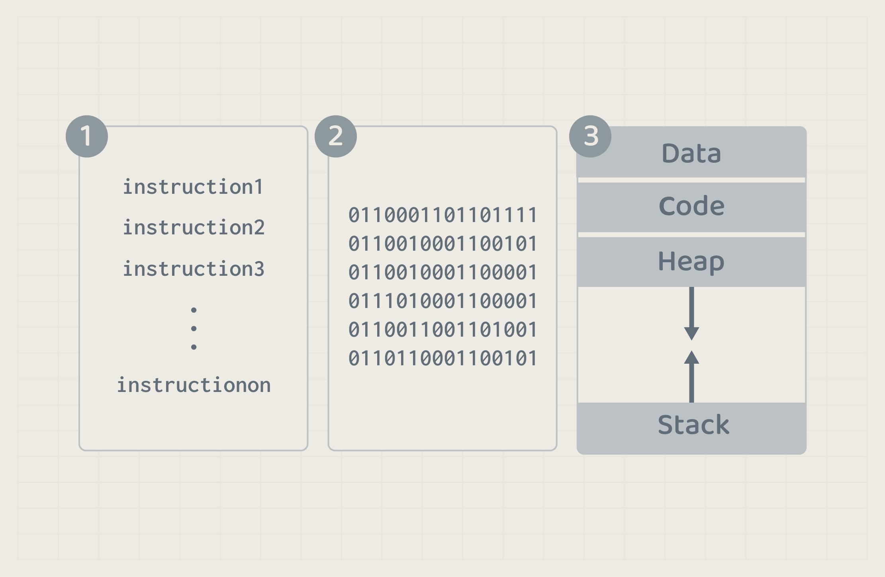

# Operating System in relation with HW resources
In this document, we will learn how a program gets executed and passed through the different hardware components.

## The life cycle of a program
The program in its life time, is going to walk through several stages. 
1. Source Code
2. Executable File
3. Running Program (Process)

At the start of writing a program, it will be just a **source code** which is a set of instruction written in a specific language. When the program is compiled, the **executable file** will be generated. The executable file is stored in the disk permanently until the user clicks on it to run. When a program start running, we call it a **Process**.

## Running a Program

