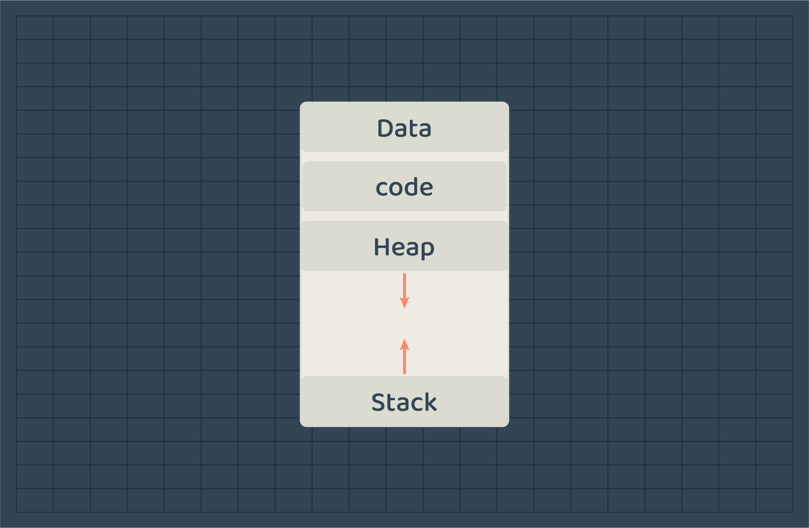
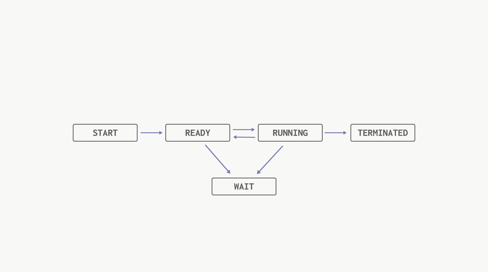
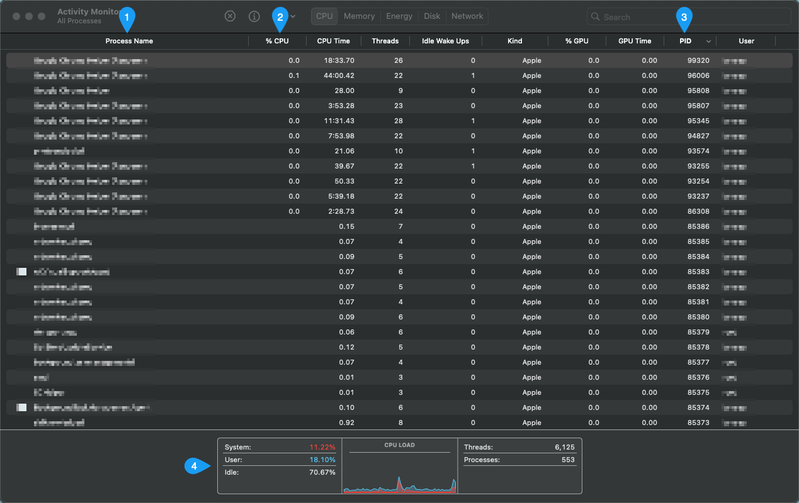
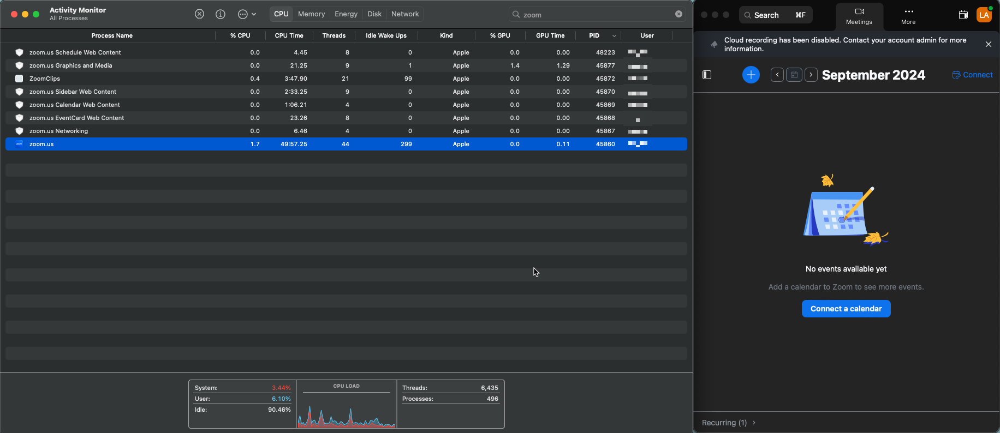
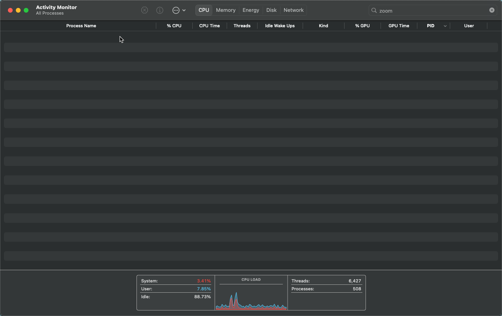
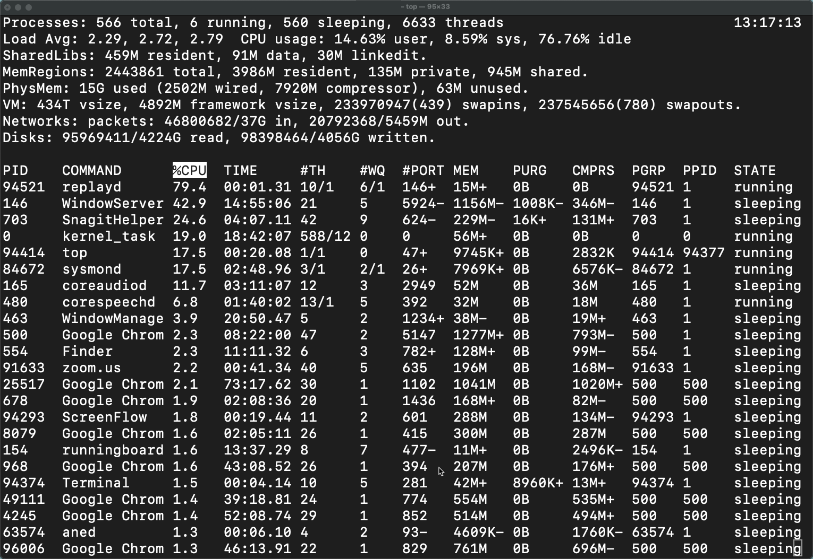
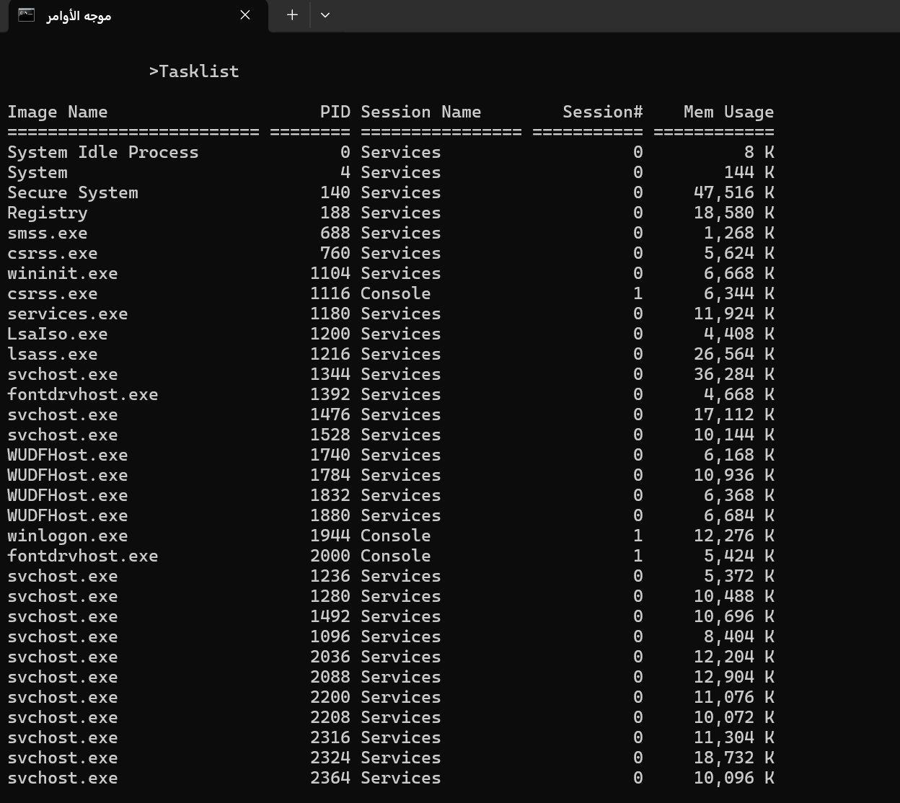
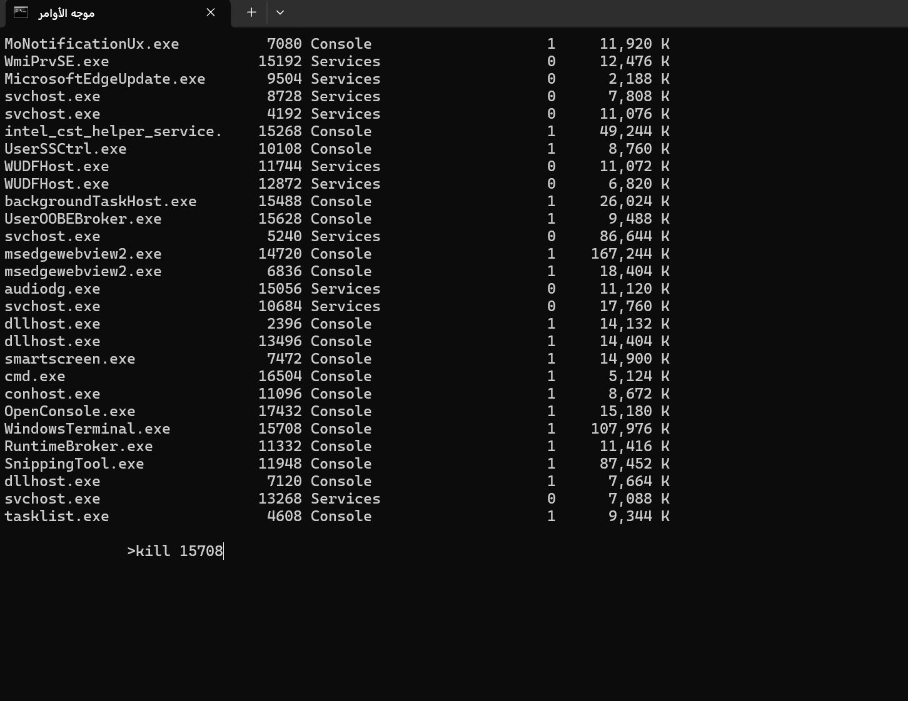

# Process Anatomy
A process is essentially a program that is currently being executed. When a program runs, it is transformed into a process, which is assigned an identifier (ID), a state, memory space, and various other attributes. In this lesson, we will take a closer look at processes and the related data associated with them.

## Process
You can think of a process as a task assigned to the computer that it needs to execute. For the computer to perform this task effectively, it must understand the information and resources required by the program. This necessity is why processes are organized in a standardized format that allows the operating system to know how to interact with them.

When a process is loaded into memory, it is divided into two main sections: the static section and the dynamic section.

[]
[Image 2]

### Static Section
The static section contains data that is known at compile time, such as:
- **Global Variables**: These variables are accessible from any part of the program and retain their values throughout the program's execution.
- **Program Instructions**: This is the executable code/instructions written by the programmer that the CPU processes or execute.

The size and layout of this static section are determined during the compilation of the program, meaning that the necessary space for these elements is allocated before the program runs.

### Dynamic Section
In contrast, the dynamic section is responsible for data that is defined at runtime. This includes:
- **Heap**: This area is used for dynamically allocated memory, such as when new objects are created. The heap allows for flexible memory usage as resources can be allocated and deallocated as needed while the program is running.
- **Stack**: The stack is used for managing function calls and local variables. Each time a function is invoked, a new stack frame is created to hold its local variables and return address; this frame is removed when the function completes.

## Process Metadata
Processes are managed by the operating system, which handles their creation, scheduling, and termination. To do so, the operating system stores metadata about the process for management purposes.

|Data | Description|
|--------|------------|
| PID    |Process ID uniquely identifies a process |
| State  |The current state of the process|
| PC     |A pointer to the next instruction to be executed in the program/process |
| User  | The user who started the process |

There are more information some of them are specific to the operating system needs for example the process priority to understand when will it be executed.

## Process State Life-Cycle
Each process has the information of its state, the state the process can be at are the following. 

- **New**: The process has just been created.
- **Ready**: The process is ready to be executed.
- **Running**: The process is currently being executed.
- **Blocked/Waiting**: The process is waiting for an external even to happen such as I/O device availability or operation.
- **Terminated**: The process has completed its execution.

## Process Preview
OS provides some services for programs or users to manage processes, such as creating, pausing, executing, or killing a process. To access these features we may use some functions in programming languages that communicate directly with the OS or we can use one of the interfaces provided to interact with processes such as the command line and GUI. In our case, we will demonstrate the concept of managing processes using GUI such as **Activity Monitor** in MacOS or **Task Manager** in Windows OS. And using the command line. However, we will discuss how to manage processes using the libraries in programming languages later on.

### Activity Monitor 
It is a utility in MacOS devices that helps you analyze and manage processes and see their resource usage.

Above is an image of the activity monitor program, it displays the current activities of the computer including running programs (processes).
1. **Process Name**: is a list of all currently running programs.
2. **CPU**: is the CPU usage by each process. 
3. **PID**: each process is assigned to a process ID for identifying them.
4. **CPU Load**: is an overall current CPU state that identifies how much CPU is used and by whom. 

> Resource for [Activity Monitor](https://support.apple.com/en-sa/guide/activity-monitor/welcome/mac).

> Resource for [Task Manager](https://learn.microsoft.com/en-us/shows/inside/task-manager).

Let us open the Zoom program and search for it using the Activity Monitor. 

As you can see, when Zoom is running, there must be a process which was displayed in the image above. What do you think will happen if we close Zoom? 
The process must be terminated since the program is not running, let us terminate it and check again. 

> To quit Zoom, you can double-click on the process and choose quit. Or, close the program from the zoom itself.

### Command Line
Open your terminal on MacOS & Linux or command line prompt on Windows.

#### MacOS & Linux
use the `top` command to display all the current processes and their data. 

To kill a process, you can use the `kill` command and provide it with the process ID. The following video demonstrates the complete process of displaying and terminating a process (we terminated the terminal process as an example)

https://github.com/user-attachments/assets/61a99668-59d3-4fa9-9caf-8d2fec915803

#### Windows
For windows users, you can type `Tasklist` command to display all processes.

> Resource for [Tasklist command](https://ss64.com/nt/tasklist.html).

Here is an example of listing current processes and terminating the CMD process using the command line.

Once we kill the cmd process, the cmd window will be closed same as the MacOS video.

## Project 
- Display the process list on your device and investigate its properties. 
- Kill a process from the CMD.

