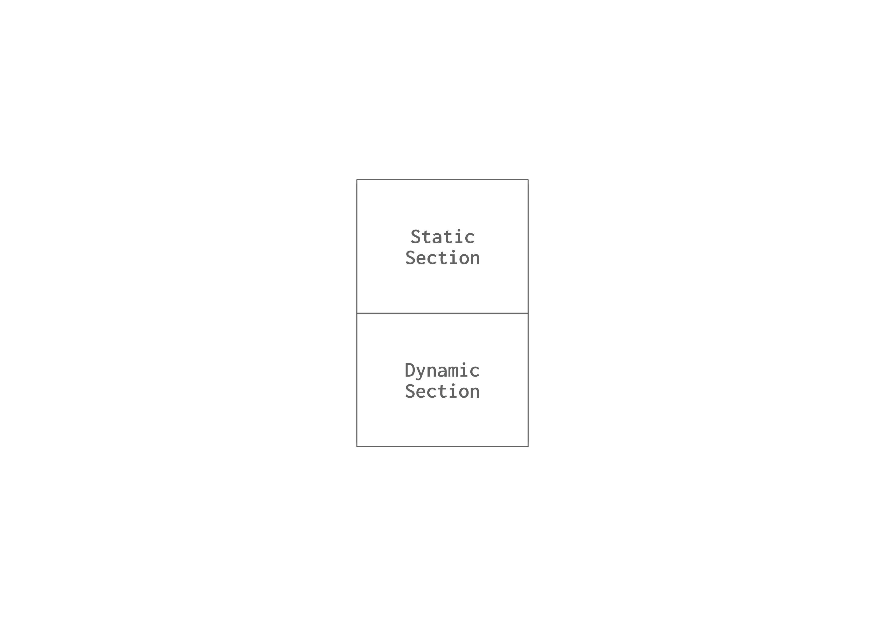
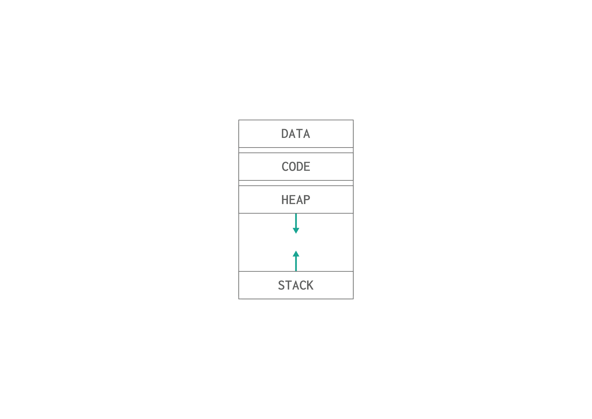

# Process Anatomy
A process is essentially a program that is currently being executed. When a program runs, it is transformed into a process, which is assigned an identifier (ID), a state, memory space, and various other attributes. In this lesson, we will take a closer look at processes and the related data associated with them.

## Process
You can think of a process as a task assigned to the computer that it needs to execute. For the computer to perform this task effectively, it must understand the information and resources required by the program. This necessity is why processes are organized in a standardized format that allows the operating system to know how to interact with them.

When a process is loaded into memory, it is divided into two main sections: the static section and the dynamic section.

### Static Section
The static section contains data that is known at compile time, such as:
- **Global Variables**: These variables are accessible from any part of the program and retain their values throughout the program's execution.
- **Program Instructions**: This is the executable code/instructions written by the programmer that the CPU processes or executes.

The size and layout of this static section are determined during the compilation of the program, meaning that the necessary space for these elements is allocated before the program runs.

### Dynamic Section
In contrast, the dynamic section is responsible for data that is defined at runtime. This includes:
- **Heap**: This area is used for dynamically allocated memory, such as when new objects are created. The heap allows for flexible memory usage as resources can be allocated and deallocated as needed while the program is running.
- **Stack**: The stack is used for managing function calls and local variables. Each time a function is invoked, a new stack frame is created to hold its local variables and return address; this frame is removed when the function completes.

## Process Metadata
Processes are managed by the operating system, which handles their creation, scheduling, and termination. To do so, the operating system stores metadata about the process for management purposes.

|Data | Description|
|--------|------------|
| PID    |Process ID uniquely identifies a process |
| State  |The current state of the process|
| PC     |A pointer to the next instruction to be executed in the program/process |
| User  | The user who started the process |

There is more information some of them are specific to the operating system needs for example the process priority to understand when will it be executed.

## Process State Life-Cycle
Each process has the information of its state, the state the process can be at are the following. 

- **New**: The process has just been created.
- **Ready**: The process is ready to be executed.
- **Running**: The process is currently being executed.
- **Blocked/Waiting**: The process is waiting for an external event to happen such as I/O device availability or operation.
- **Terminated**: The process has completed its execution.

## Summary 
We have introduced the overall picture of how operating systems manage processes and their life cycle. But keep in mind that it was only introduced at a high-level to better understand future topics and discussions.
Later on, we will deep dive into how processes are mapped and managed, and how can we request services from the operating system using syscalls.

