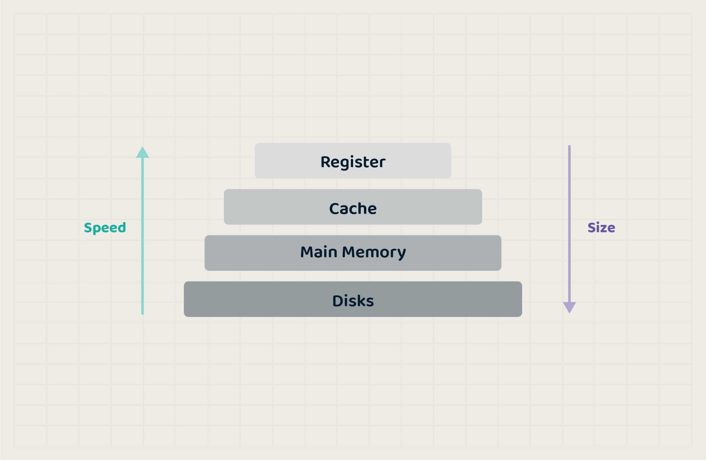
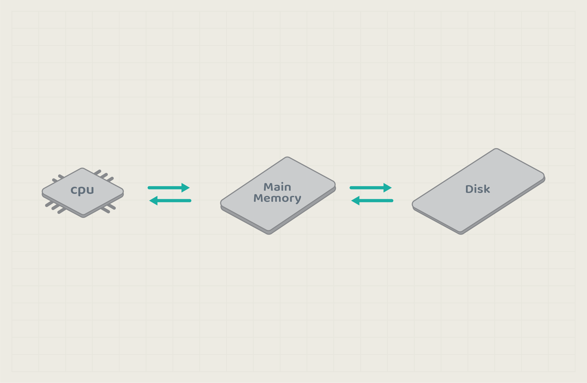
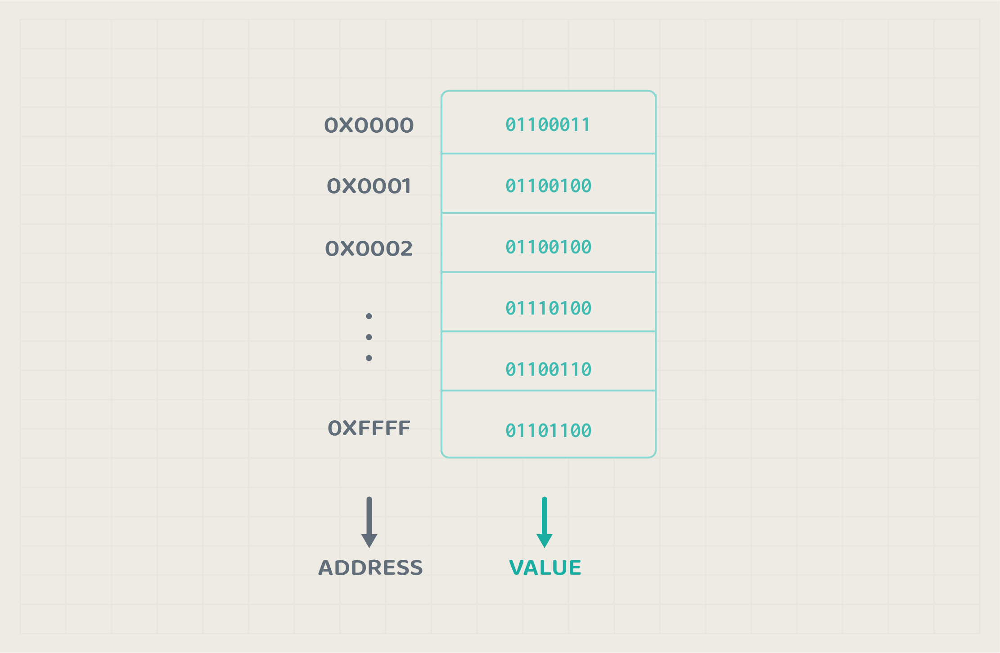

# Memory Management Introduction

Computers process data, but this data doesn’t appear out of nowhere; it is stored in a crucial component known as the **memory**. 

Memory comes in various types and sizes. The two main types are **Random Access Memory (RAM)**, which temporarily stores data, and **Read Only Memory (ROM)**, which permanently holds data. 

Additionally, the CPU has small storage areas called **registers**, which hold data needed for quick processing.

## Memory Types and Usage

### Registers
Registers are the smallest form of memory, located inside the CPU. They store data for fast access during processing.

### Cache
Cache memory is a small, high-speed storage that makes data retrieval from RAM more efficient by holding the most frequently accessed data.

### Random Access Memory (RAM)
RAM, often referred to as **main memory**, is directly accessed by the CPU. It is faster than ROM, although smaller in size. The operating system uses RAM to load programs as processes for the CPU to execute. Once a process is loaded and ready, the CPU reads data directly from RAM to execute it. When the process finishes, the operating system frees up that memory for other processes.

It’s important to note that RAM is volatile, meaning all data is lost when the computer is turned off or loses power.

#### How Main Memory Looks Like
Main memory is a large array of bytes with an address that refers to each entry.

> Note: in this chapter, we will focus on main memory management.

### Read Only Memory (ROM)
ROM is a larger memory space used to store permanent data that should not be lost when the power is turned off. It is non-volatile, which means the information remains intact.

For example, if you update a file but forget to save it before a sudden power loss, that update will be lost since it was stored in volatile RAM. However, if you save your changes, they will be stored permanently in ROM.

## Operating System and Memory Management
OS is responsible for managing hardware resources, which main memory is part of. It involves the efficient allocation, utilization, and management of the computer's physical memory resources to ensure that programs and processes can run effectively and without conflicts.

OS insures the following in relation to memory. 
- Allocate and deallocate memory spaces as required. 
- Keep track of each memory block usage and by which process.
- Determine which parts of memory blocks should move in or out of the memory. 