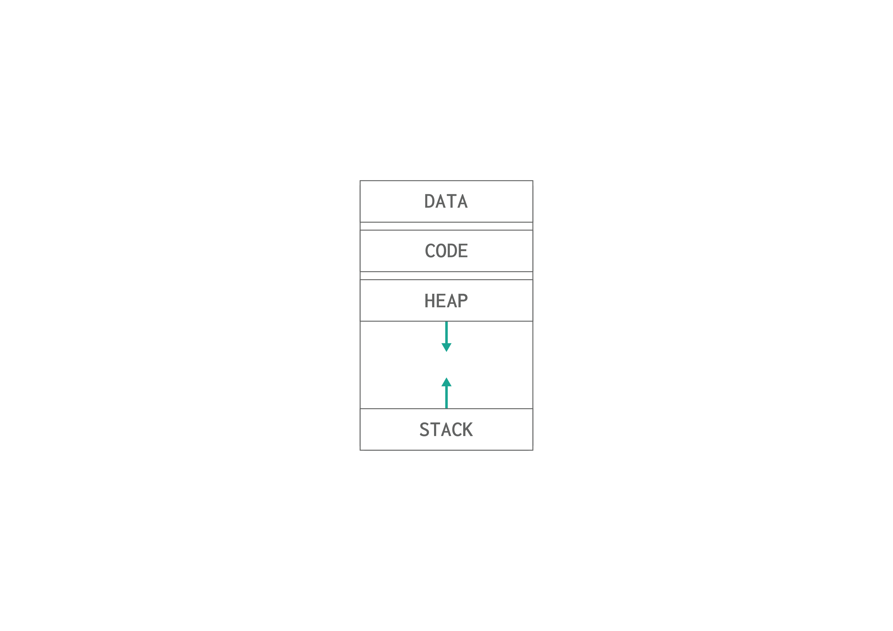

# Memory and Process
Earlier, we have introduced the concept of process. Which is a program in execution. When you run a program, the OS will map the program into memory as a process. Which consist of data, code, stack, and heap. In this lesson, we will delve into each section/segment in the process stored in memory in details.




## Process Memory Segments 
When a process is loaded into memory, it is organized into several distinct segments, each serving a specific purpose. These segments are the **code**, **data**, **heap**, and **stack**. Let’s explore each segment in detail:

### 1. Code Segment

#### Description
The **code segment** (or text segment) contains the compiled executable code of the program. This is the actual machine code that the CPU executes. It's typically read-only to prevent modification during execution, ensuring the integrity of the program.

#### Storage
- **Location**: The code segment is loaded into a fixed area of memory when the process starts.
- **Access**: The CPU fetches instructions from this segment to execute them.

#### Example
Consider the following simple C program:

```c
#include <stdio.h>

int main() {
    printf("Hello, World!\n");
    return 0;
}
```

When compiled, the machine code corresponding to the `main` function and the `printf` call resides in the code segment.

### 2. Data Segment

#### Description
The **data segment** contains global and static variables that are initialized by the programmer. Unlike the code segment, this area is writable, allowing for modifications during execution.

#### Storage
- **Location**: It is typically located immediately after the code segment in memory.
- **Initialized vs. Uninitialized**: This segment can be further divided into initialized data (e.g., `int a = 10;`) and uninitialized data (e.g., `static int b;`).

#### Example
In the following code:

```c
int globalVar = 5; // Initialized global variable
static int staticVar; // Uninitialized static variable

int main() {
    return 0;
}
```

`globalVar` gets stored in the initialized part of the data segment, while `staticVar` is stored in the uninitialized part.

### 3. Heap Segment

#### Description
The **heap segment** is used for dynamic memory allocation. This is where memory is allocated at runtime using functions like `malloc()` in C, or `new` in C++ and Java. The size of the heap can grow or shrink as needed, depending on the program's requirements.

#### Storage
- **Location**: The heap grows upwards, meaning that as memory is dynamically allocated (e.g., using `malloc` in C or new in C++), it occupies higher memory addresses.
- **Management**: The programmer is responsible for managing memory in this segment, including freeing allocated memory to avoid memory leaks.

> Note: there is an issue called **memory leak**, it happens when an allocated memory address is no longer needed but was not deallocated. It decreases the performance of the computer since there is less space to be used in the memory.

> Note: Some high-level programming languages implement a garbage collector, which automatically manages memory by reclaiming unused memory spaces, thereby reducing the risk of memory leaks.

#### Example
Consider the following example where memory is allocated dynamically:

```c
#include <stdlib.h>
#include <stdio.h>

int main() {
    int *array = malloc(10 * sizeof(int)); // Allocating memory for an array of 10 integers

    for (int i = 0; i < 10; i++) {
        array[i] = i * 2;
        printf(" Array[%d]: %d \n",i,array[i]); // Print array elements
    }

    free(array); // Freeing allocated memory
    return 0;
}
```

In this example, the memory for `array` is allocated on the heap since we determined its size at runtime.

### 4. Stack Segment

#### Description
The **stack segment** is used for function call management, including local variables and function parameters. Each time a function is called, a new stack frame is created to hold its local data and return address.

#### Storage
- **Location**: The stack grows downwards from higher memory addresses towards lower ones.
- **Automatic Management**: Memory on the stack is automatically managed; it is allocated when a function is called and deallocated when the function exits.

#### Example
Consider a function with local variables:

```c
#include <stdio.h>

void myFunction() {
    int localVar = 10; // Local variable stored on the stack
    printf("%d\n", localVar);
}

int main() {
    myFunction(); // Calling the function
    return 0;
}
```
In this example, `localVar` is stored in the stack segment, and its memory is automatically freed when `myFunction` returns.

> Note: **Code Segment** is specifically designed to hold executable instructions (machine code) of the program. The code segment is where all function definitions, including `main`, are stored in a read-only format.

>Note: The **Stack** is used for managing function calls, local variables, and return addresses during program execution. It is a temporary storage area for data that needs to be accessed quickly and is automatically managed by the operating system.

## Example 

This example is just to demonstrate how globals and local data are store. As we said, local variables are stored in the stack which goes from high memory addresses to low memory addresses. So, if we declared two local variables, the first one will take high memory address and the second will take lower. 

```c
#include <stdio.h>


int main(){
    char a = 'a';
    char b = 'b';

    printf("the address of a is: %p \n", &a);
    printf("the address of b is: %p \n", &b);
}
```

output: 
```
the address of a is: 0x16f2832bf 
the address of b is: 0x16f2832be 
```
But, global variables are stored in the data segment, which means the order will be reversed. The first variable created will take the first available free space and the second will take the next address as the following. 
```c
#include <stdio.h>

    char a = 'a';
    char b = 'b';

int main(){

    printf("the address of a is: %p \n", &a);
    printf("the address of b is: %p \n", &b);
}
```

output: 
```
the address of a is: 0x100734000 
the address of b is: 0x100734001 
```

### Summary

- **Code Segment**: Contains the executable code; read-only during execution.
- **Data Segment**: Holds global and static variables; writable.
- **Heap Segment**: Used for dynamic memory allocation; managed by the programmer.
- **Stack Segment**: Manages function calls and local variables; automatically managed.

Understanding how these segments are stored and managed is crucial for efficient programming and memory management in any application.

### Example

```c
#include <stdio.h>

int globalCount = 10;      // Data Segment (global variable)

void displayValues() {
    static int staticCount = 5;  // Data Segment (static variable)
    int localCount;               // Stack (local variable)

    printf("Global Count: %d\n", globalCount);      // Code Segment
    printf("Static Count: %d\n", staticCount);      // Code Segment
    printf("Local Count: %d\n", localCount);        // Code Segment
}

int main() {
    displayValues();           // The function definition will be in the Code Segment but the execution context (variables and return address) are in the Stack segment
    return 0;                 // Code Segment (return statement)
}

```

## Project
- Project Link (Identify Memory Segments used to Store Variables)