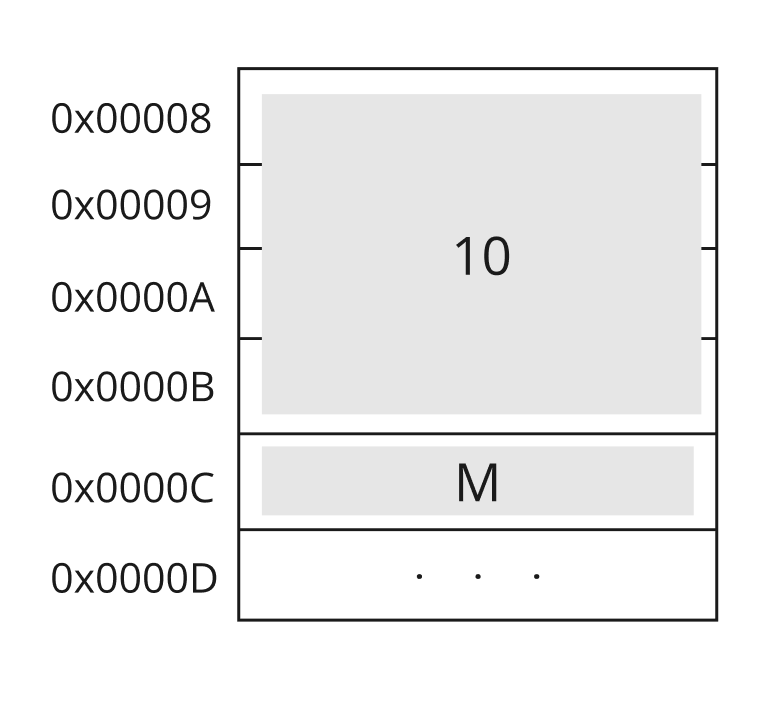

# Memory Management
As described earlier, main memory is a collection of cells, each with its unique address. Memory is typically organized in such a way that each memory address corresponds to a single byte. However, data types in programming languages can occupy multiple bytes, depending on their type's size. Understanding these sizes is crucial for efficient memory management and data manipulation in programming.

> Note: Computers differ in how they store and manage data, typically using a unit called a **word**. A word can consist of a single or multiple bytes, depending on the architecture of the computer. Common word sizes are 16 bits (2 bytes), 32 bits (4 bytes), or 64 bits (8 bytes).

## Data Types
Data types in programming languages specify how much space is needed to store a value. 

- **Char**: 1 byte
- **Short**: 2 bytes
- **Int**: 4 bytes
- **Long**: 4 bytes or 8 bytes
- **Float**: 4 bytes
- **Double**: 8 bytes
- **Pointer**: Varies based on architecture—4 bytes on 32-bit systems and 8 bytes on 64-bit systems

> **Note**: These sizes do not apply to all architectures.


We need to understand these types to better utilize memory and understand its behavior in certain cases.

Let's take an example of a variable in C. 

```c
int main(){
    int num = 10;
    char ch = 'M';
    return 0;
}
```

what we did here is create two variables that are going to be stored in memory specifically in the stack segment since they are local variables for the main function. 
The first variable will reserve 4 bytes to store the value `10` and the second will use 1 byte to store the value `M` in memory. 



## Pointers 
Pointers are variables that can store memory addresses. C provides us with the flexibility of managing pointers.

Let us take the example from earlier.
```c
int main(){
    int num = 10;
    char ch = 'M';
    return 0;
}
```
<!-- **[Image of memory addresses and values]** -->
Let's create a pointer that points to the address of the variable `num` and prints its value.


```c
#include <stdio.h>

int main(){
    int num = 10;
    char ch = 'M';
    int* pointer = &num;
    printf("The address of num is: %p \n", &num );
    printf("The pointer value is: %p \n",pointer);
    return 0;
}
```
Output
```
The address of num is: 0x16cea72c8 
The pointer value is: 0x16cea72c8 
```
The ampersand symbol means the "Address of". So, when we say `&num` we mean the address that variable num is stored in. 
The star `*` on the other hand means a pointer that will store a memory address. 

You can read the data in a memory address using the dereference operator * as the following. 

```c
#include <stdio.h>

int main(){
    int num = 10;
    char ch = 'M';
    int* pointer = &num;
    printf("The address of num is: %p \n", &num );
    printf("The pointer value is: %p \n",pointer);
    printf("The value stored in the pointer address is: %d \n",*pointer);

    return 0;
}
```
Output
```
The address of num is: 0x16d2272c8 
The pointer value is: 0x16d2272c8 
The value stored in the pointer address is: 10 
```
As you noticed, the value stored in the address the pointer references to is 10.


### Increment and Decrement 
You can apply arithmetic operations on pointers, let us have the same example with some changes as the following. 
```c
#include <stdio.h>

int main(){
    int num = 10;
    char ch = 'M';
    int* numPointer = &num;
    char* chPointer = &ch;
    printf("The address of num is: %p \n", numPointer );
    printf("The address of ch is: %p \n", chPointer );

    return 0;
}
```
Output
```
The address of num is: 0x16cf572b8 
The address of ch is: 0x16cf572b7 
```

You can do the following on the pointers 

```c
#include <stdio.h>


int main(){
    int num = 10;
    char ch = 'M';
    int* numPointer = &num;
    char* chPointer = &ch;
    printf("The address of num is: %p \n", numPointer );
    printf("The address of num + 1 is: %p \n", numPointer+1 );
    printf("The address of num - 1 is: %p \n", numPointer-1 );
    printf("The address of ch is: %p \n", chPointer );
    printf("The address of ch + 1 is: %p \n", chPointer+1 );
    printf("The address of ch - 1 is: %p \n", chPointer-1 );

    return 0;
}
```

output 

```
The address of num is: 0x16b2632b8 
The address of num + 1 is: 0x16b2632bc 
The address of num - 1 is: 0x16b2632b4 
The address of ch is: 0x16b2632b7 
The address of ch + 1 is: 0x16b2632b8 
The address of ch - 1 is: 0x16b2632b6 
```
As you may notices, the increment and decrement depends on the size of the data type the pointer refers to. If char, then it will increment and decrement by 1 byte. If integer, it will use 4 byte. 

This can helps us to access other data in the program with out referencing them directly, lets have an example. 

```c
#include <stdio.h>


int main(){
    int num = 10;
    int nextNum = 20;
    int* numPointer = &num;
    int* nextNumPointer = &nextNum;
    printf("The address of num is: %p \n", numPointer );
    printf("The address of next num is: %p \n", nextNumPointer );

    return 0;
}
```

output
```
The address of num is: 0x16f4e32a8 
The address of the next num is: 0x16f4e32a4 
```

<!-- Since they are local variables, they will take spaces from higher addresses to lower ones.  -->
If we used the num address -1 we will get the nextNum address. 

```c
#include <stdio.h>


int main(){
    int num = 10;
    int nextNum = 20;
    int* numPointer = &num;
    int* nextNumPointer = &nextNum;
    printf("Addresses: \n");
    printf("The address of num is: %p \n", numPointer );
    printf("The address of num - 1 is: %p \n", numPointer-1 );
    printf("The address of next num is: %p \n", nextNumPointer );

    printf("Values: \n");
    printf("The value of num is: %d \n", *numPointer );
    printf("The value of num - 1 is: %d \n", *(numPointer-1) );
    printf("The value of next num is: %d \n", *nextNumPointer );


    return 0;
}
```

output
```
Addresses: 
The address of num is: 0x16f56b2a8 
The address of num - 1 is: 0x16f56b2a4 
The address of next num is: 0x16f56b2a4 
Values: 
The value of num is: 10 
The value of num - 1 is: 20 
The value of next num is: 20
```
We noticed that we accessed the next num value by only understanding how memory maps its local variables and the use of pointers. 


<!-- [Continue this paragraph by stating that we can use this flexibility by accessing struct data from the first pointer we can use the offset to get the next variable. (same goes for the arrays) ] -->

## The Class
You may know what a class is, but we will walk through the concept from the memory perspective. 
A class is a way to construct a new type, you can determine the structure of your type by combining the types defined in the language. 
For example, constructing the  `Person` type in C++. 

```C
#include <iostream>
#include <string>

class Person {
public:
    int age;
    std::string name;
};

int main() {
    Person s; // Create an instance of Person
    s.name = "Sara"; // Set the name
    s.age = 17;      // Set the age

    // Output the person's details
    std::cout << s.name << " is " << s.age << " years old." << std::endl;

    return 0;
};
```

A newly created Person will have the below layout.


If you print the sizeof each value as the following 
```c++
#include <iostream>
#include <string>

class Person {
public:
    int age;
    std::string name;
};

int main() {
    Person s; // Create an instance of Person
    s.name = "Sara"; // Set the name
    s.age = 17;      // Set the age

    std::cout << sizeof s.name << "\n";
    std::cout << sizeof s.age << "\n";

    // Output the person's details
    std::cout << s.name << " is " << s.age << " years old." << std::endl;

    return 0;
};
```

You will have the following output
```
24
4
Sara is 17 years old.
```
This means the string takes 24 bytes from the memory to store its value while int takes 4 bytes.


> Note: we assumed that each cell contains a single byte. But, some devices store word size which can be 2 bytes or more.

<!-- The concept of class 
The concept of struct 
The concept of memory alignment by ordering data types in the class or struct -->


## The Struct
C language does not support OOP natively. But it has a concept it uses to construct user-defined types such as classes which is the **struct**. 

A struct is a user-defined data type in C (also supported in C++) that allows you to group related variables of different types into a single unit. Structs are useful for organizing data into meaningful collections, making it easier to manage and manipulate complex data structures.

```C
#include <stdio.h>

struct student{
    int id;
    int age;
    char grade;
};


int main(){
    struct student sami;
    sami.id = 102;
    sami.age = 17;
    sami.grade = 'A';
    printf(" Sami's id is %d \n", sami.id);
    printf(" Sami's age is %d \n", sami.age);
    printf(" Sami's grade is %c \n", sami.grade);
    return 0;
}

```

In the above example, we have created a new struct to construct the Student type.


output:
```
 Sami's id is 102 
 Sami's age is 17 
 Sami's grade is A 
```
You can also use the pointer concept to create a function that takes a pointer to a student and print its information as the following. 
```c

#include <stdio.h>

struct student{
    int id;
    int age;
    char grade;

};

void printInfo(struct student* s){
    printf(" The student id is %d \n", s->id); // -> is a shorthand for (*s).id, which mean dereference and read the value of id
    printf(" The student age is %d \n", s->age);
    printf(" The student grade is %c \n", s->grade);
}


int main(){
    struct student sami;
    sami.id = 102;
    sami.age = 17;
    sami.grade = 'A';
    printInfo(&sami);
    
    return 0;
}

```

output: 
```
 The student id is 102 
 The student age is 17 
 The student grade is A 
```

Let us investigate how the function works by printing the address of student sami and its properties addresses as well.
```c
#include <stdio.h>

struct student{
    int id;
    int age;
    char grade;

};

void printInfo(struct student* s){
    printf(" The student id is %d \n", s->id);
    printf(" The student age is %d \n", s->age);
    printf(" The student grade is %c \n", s->grade);
}


int main(){
    struct student sami;
    sami.id = 102;
    sami.age = 17;
    sami.grade = 'A';

    printf("Address of sami %p \n", &sami);
    printf("Address of id %p \n", &sami.id);
    printf("Address of age %p \n", &sami.age);
    printf("Address of grade %p \n", &sami.grade);
    
    return 0;
}
```

output:
```
Address of sami 0x16d9972a0 
Address of id 0x16d9972a0 
Address of age 0x16d9972a4 
Address of grade 0x16d9972a8 
```
As it appears from the above example, `&sami` is the same as `&sami.id`. But how did the function `printInfo()` understand where to read the data of age and grade if it only has the address of id? 


What happened exactly is that the pointer refers to the first address that stores object sami in. And based on the data type (struct) it will offset by the size of data in each section.


### Struct with string
String data type is not defined in C natively, so we use a character array to represent string data type. 

>Note: You can use the concept of struct to build your own string data type. 

#### Example 
```c
#include <stdio.h>
#include <string.h>

#define NAME_LENGTH 20
struct Person{
    int age;
    char name[NAME_LENGTH];
};


int main(){
    struct Person sara;
    sara.age = 17;
    strncpy(sara.name, "Sara", NAME_LENGTH - 1);
    sara.name[NAME_LENGTH-1] = '\0'; // the \0 character specifies the end of string
    printf(" %s is %d years old", sara.name, sara.age);
    return 0;
}
```

> Note: In C, you cannot directly assign a string literal to a character array after its declaration because arrays in C are not assignable. Instead, you must use a function like strcpy or strncpy to copy the string into the array.

> Note: The \0 character is known as the null character in C and C++. It serves as a string terminator, indicating the end of a string in memory. 


## Arrays
Arrays are collections of data in one container, in C arrays can be defined as the following. 

```c
#include <stdio.h>

int main(){
    int numbers[] = {1,2,3};
    printf("%p \n", numbers);
    printf("%d \n", numbers[0]);
    printf("%d \n", numbers[1]);
    printf("%d \n", numbers[2]);

    return 0;
}
```

output
```
0x16bc5f2a8 
1 
2 
3 
```
As you noticed, when printing `numbers` array we see an address. It is the address if the start of the array. Let us print other element addresses. 

```c
#include <stdio.h>

int main(){
    int numbers[] = {1,2,3};
    printf("%p \n", numbers);
    printf("%p \n", &numbers[0]);
    printf("%p \n", &numbers[1]);
    printf("%p \n", &numbers[2]);

    return 0;
}
```

output
```
0x16d7b32a8 
0x16d7b32a8 
0x16d7b32ac 
0x16d7b32b0 
```
The address of `numbers[0]` is 0x16d7b32a8, and if we offset by one (size of an int) it will give us the address of `numbers[1]` which is 0x16d7b32ac.

We conclude that in order to get the next element, we will offset it by the size of the data type in the array.

> Note: The array in this example is stored in the stack since it is declared inside a function.

> Note: Arrays, regardless of where they are allocated (stack or heap), will have their elements in contiguous memory. Thus, the memory addresses for the elements of the array are sequentially higher.

<!-- Arrays in the stack get reserved a contiguous memory space as needed by the number of elements. Once the block of memory is allocated for the arrays elements, they will be stored from lower to higher memory addresses in the block. This is why local variables are stored downward in the stack while arrays are stored upward. -->


## malloc & free
We previously introduced the concept of system calls (syscalls), which are services that can be requested from the operating system to perform specific actions. One of these services related to memory management is the allocation and deallocation of memory spaces as needed. To facilitate this, programming languages such as C provide wrapper functions that are responsible for making these calls according to the correct protocols. In C, to allocate memory space, we use `malloc`, and to deallocate the memory that has been reserved, we use `free`.


Using `malloc`, we can create a dynamic array that is stored in the heap, even if the allocation occurs within a function. This is because `malloc` is called at runtime and requests memory space from the operating system, allowing for flexible sizing. Unlike stack-allocated arrays, which are automatically deallocated when the function exits, heap-allocated arrays persist until they are explicitly freed using `free`. This difference in lifetime gives developers more control over memory management but also requires careful handling to avoid memory leaks.

Let's have an example, of creating a dynamic array that will be stored in the heap.

```c
#include <stdio.h>
#include <stdlib.h> //used to call malloc and free

int main() {
    // Number of elements
    int n = 5;

    // Allocate memory for an array of integers
    int* array = malloc(n * sizeof(int));

    // Check if memory allocation was successful
    if (array == NULL) {
        puts("Memory allocation failed\n");
        return 1; // Exit with error
    }

    // Initialize the array
    for (int i = 0; i < n; i++) {
        array[i] = i + 1; // Assigning values to the array
    }

    // Print the values in the array
    printf("Array elements:\n");
    for (int i = 0; i < n; i++) {
        printf("%d ", array[i]);
    }
    printf("\n");

    // Deallocate the memory
    free(array);
    array = NULL; // Set pointer to NULL after freeing

    return 0; // Successful exit
}
```

output
```
Array elements:
1 2 3 4 5 
```

Let us print the value of an element address before and after the free function.

```c
#include <stdio.h>
#include <stdlib.h> 

int main() {
    int n = 5;

    int* array = malloc(n * sizeof(int));

    if (array == NULL) {
        puts("Memory allocation failed\n");
        return 1; 
    }

    for (int i = 0; i < n; i++) {
        array[i] = i + 1; 
    }

    printf("Array elements:\n");
    for (int i = 0; i < n; i++) {
        printf("%d ", array[i]);
    }
    printf("\n");

    int* ptr = &array[1];  // create a pointer to the second element 
    printf("%d \n", *ptr); // print the value before freeing the memory space

    free(array);
    printf("%d \n", *ptr); // print the value after freeing the memory space
    
    array = NULL; 


    return 0; 
}
```

output
```
1 2 3 4 5 
2 
0
```

Before freeing the memory space, it used to store the number 2 as a value. 
<!-- However, the value after freeing is 0 is an example of undefined behavior. The value could be still 2 but with no reference. -->


> Note: Wrapper functions are functions that serve as intermediaries between a client (such as a program or module) and a more complex underlying system or function. They are used to simplify the interface, and improve usability.

> Note: In languages like C, functions such as `malloc` and `free` act as wrappers that interact with the operating system to manage memory.


## Alignment and Padding 
Memory alignment and padding are essential concepts in computer architecture that affect data storage and access efficiency. Alignment refers to arranging data at memory addresses that are multiples of a specific size, typically dictated by the data type and architecture's word size, which enhances CPU retrieval speed. Padding involves adding extra bytes to data structures to ensure proper alignment of their members, potentially increasing memory usage. Understanding these concepts is crucial for developers aiming to optimize performance in systems programming and embedded systems.

> Note: Word size is the size of bytes the computer uses for processing data.

> Note: A 4-word size (or 32-bit) computer means it processes data in chunks of 4 bytes at a time. This is called the word size.


In a 4-word size (32-bit) architecture, the CPU typically fetches memory in chunks that are multiples of 4 bytes. Look at the following image. 


integers typically need 4 bytes to store their data. if the CPU reads by a multiple of 4 bytes, then it will read the integer data in two cycles, the first 4 bytes and then the second 4 bytes to complete reading the value. 

To enhance the CPU performance, padding by 3 bytes will be added to align data properly. 


By padding, the int value will be stored at address `0x0000C` which needs one fetch cycle to read and write.

Lets apply the concept in C. When creating a struct, we need to mind how we order variable definition to insure correct alignment of data in memory.

```c
#include <stdio.h>

struct AlignmentExample {
    char a;      // 1 byte
    int b;       // 4 bytes
    char c;      // 1 byte
};

int main() {
    struct AlignmentExample example;
    printf("Size of the struct: %lu bytes\n", sizeof(example));
    printf("Address of a: %p\n", &example.a);
    printf("Address of b: %p\n", &example.b);
    printf("Address of c: %p\n", &example.c);
    
    return 0;
}
```

What is the size of the struct example? It should be 6 bytes since we have int which is 4 bytes long and 2 characters each takes 1 byte.

Output 
```
Size of the struct: 12 bytes
Address of a: 0x16ef132b0
Address of b: 0x16ef132b4
Address of c: 0x16ef132b8
```

Why is the output 12 bytes? since int is not aligned correctly, which means it is not in an address multiple of 4 like 0, 4, 8, 16 ..., there will be a padding to align it properly on a multiple of 4 address as the following. 

| a | padding | b   | c | padding |
|:---:|:--------:|:--------:|:--------:|:--------:|
| 1 | 3 bytes | 4   | 1 | 3 bytes |
| 0x16ef132b0  |    -     |  0x16ef132b4   | 0x16ef132b8 |    -     |


As you noticed, we took more space than we needed. It might not be an issue right now, but assume we have an array of the above struct? This will leads to increased memory usage and potential inefficiencies. 

We need to mind how me align our data to ensure optimal solutions. Here is where alignment comes in to help. if we reordered the variable creations in the struct by letting the int take the first multiple of 4 addresses as the following. 

```c
#include <stdio.h>

struct AlignmentExample {
    int b;       // 4 bytes
    char a;      // 1 byte
    char c;      // 1 byte
};

int main() {
    struct AlignmentExample example;
    printf("Size of the struct: %lu bytes\n", sizeof(example));
    printf("Address of a: %p\n", &example.a);
    printf("Address of b: %p\n", &example.b);
    printf("Address of c: %p\n", &example.c);
    
    return 0;
}
```


we will get to enhance the size needed as the output shows.
```
Size of the struct: 8 bytes
Address of a: 0x16d7a32b8
Address of b: 0x16d7a32b4
Address of c: 0x16d7a32b9
```

|       b     |       a        |      c      |     padding    |
|:-----------:|:--------------:|:-----------:|:--------------:|
|   4 bytes   |    1 byte      |    1 byte   |     2 bytes    |
| 0x16b6c32b4 |  0x16d7a32b8   | 0x16d7a32b9 |        -       |


<!-- ## How can we benefit from what we saw earlier? 
- You can walk through the array (and user-defined types) by just understanding the concept of offset. 
- The concept of alignment and how to correctly create variables based on their type. 
- Understand stack frame and how it affects our implementation (calling a function in a loop).
- You can directly use malloc and free to store and release memory space.

--- -->


## Project 
- Project Link (Enhance Memory Management)


