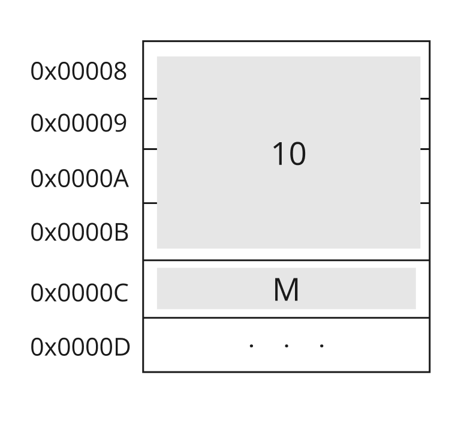
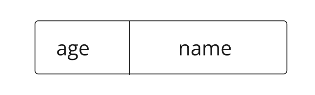
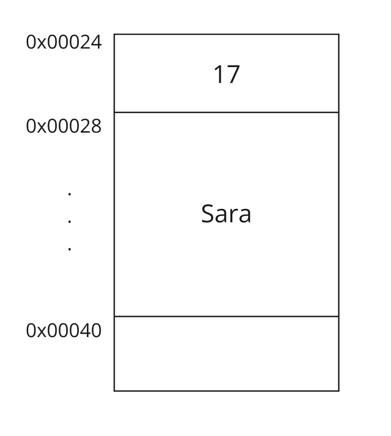

# Memory Management
As described earlier, main memory is a collection of cells, each with its unique address. Memory is typically organized in such a way that each memory address corresponds to a single byte. However, data types in programming languages can occupy multiple bytes, depending on their type's size. Understanding these sizes is crucial for efficient memory management and data manipulation in programming.

> Note: Computers differ in how they store and manage data, typically using a unit called a **word**. A word can consist of a single or multiple bytes, depending on the architecture of the computer. Common word sizes are 16 bits (2 bytes), 32 bits (4 bytes), or 64 bits (8 bytes).

## Data Types
Data types in programming languages specifies how much space is needed to store a value. 

- **Char**: 1 byte
- **Short**: 2 bytes
- **Int**: 4 bytes
- **Long**: 4 bytes or 8 bytes
- **Float**: 4 bytes
- **Double**: 8 bytes
- **Pointer**: Varies based on architecture—4 bytes on 32-bit systems and 8 bytes on 64-bit systems

> **Note**: These sizes do not apply to all architectures.


We need to understand these types to better utilize memory and understand its behavior in certain cases.

Lets take an example of a variable in C. 

```c
int main(){
    int num = 10;
    char ch = 'M';
    return 0;
}
```

what we did here is creating two variables that are going to be stored in memory specifically in the stack segment since they are local variables for the main function. 
The first variable will reserve 4 bytes to store the value `10` and the second will use 1 byte to store the value `M` in memory. 



## Pointers 
Pointers are variables that can store memory addresses. C provides us with the flexibility of managing pointers.

Let us take the example from earlier.
```c
int main(){
    int num = 10;
    char ch = 'M';
    return 0;
}
```
<!-- **[Image of memory addresses and values]** -->
Lets create a pointer that points to the address of the variable `num` and prints its value.


```c
#include <stdio.h>

int main(){
    int num = 10;
    char ch = 'M';
    int* pointer = &num;
    printf("The address of num is: %p \n", &num );
    printf("The pointer value is: %p \n",pointer);
    return 0;
}
```
Output
```
The address of num is: 0x16cea72c8 
The pointer value is: 0x16cea72c8 
```
The ampersand symbol means the "Address of". So, when we say `&num` we mean the address that variable num is stored in. 
The star `*` in the other hand means a pointer that will store a memory address. 

You can read the data in a memory address using the dereference operator * as the following. 

```c
#include <stdio.h>

int main(){
    int num = 10;
    char ch = 'M';
    int* pointer = &num;
    printf("The address of num is: %p \n", &num );
    printf("The pointer value is: %p \n",pointer);
    printf("The value store in the pointer address is: %d \n",*pointer);

    return 0;
}
```
Output
```
The address of num is: 0x16d2272c8 
The pointer value is: 0x16d2272c8 
The value store in the pointer address is: 10 
```
As you noticed, the value stored in the address the pointer reference to is 10.

<!-- [Continue this paragraph by stating that we can use this flexibility by accessing struct data from the first pointer we can use the offset to get the next variable. (same goes for the arrays) ] -->

## The Class
You may know what a class is, but we will walkthrough the concept from the memory perspective. 
A class is a way to construct a new type, you can determine the structure of your type by combining the types defined in the language. 
For example, constructing `Person` type in C++. 

```C
#include <iostream>
#include <string>

class Person {
public:
    int age;
    std::string name;
};

int main() {
    Person s; // Create an instance of Person
    s.name = "Sara"; // Set the name
    s.age = 17;      // Set the age

    // Output the person's details
    std::cout << s.name << " is " << s.age << " years old." << std::endl;

    return 0;
};
```

A newly created Person will have the below layout.



If you print the sizeof each value as the following 
```c++
#include <iostream>
#include <string>

class Person {
public:
    int age;
    std::string name;
};

int main() {
    Person s; // Create an instance of Person
    s.name = "Sara"; // Set the name
    s.age = 17;      // Set the age

    std::cout << sizeof s.name << "\n";
    std::cout << sizeof s.age << "\n";

    // Output the person's details
    std::cout << s.name << " is " << s.age << " years old." << std::endl;

    return 0;
};
```

You will have the following output
```
24
4
Sara is 17 years old.
```
Which means the string takes 24 byte from the memory to store its value while int takes 4 byte.



> Note: we assumed that each cell contains a single byte. But, some devices store word size which can be 2 bytes or more.

<!-- The concept of class 
The concept of struct 
The concept of memory alignment by ordering data types in the class or struct -->


## The Struct
C language does not support OOP natively. But it has a concept it uses to construct user-defined types such as classes which is the **struct**. 

A struct is a user-defined data type in C (also supported in C++) that allows you to group related variables of different types into a single unit. Structs are useful for organizing data into meaningful collections, making it easier to manage and manipulate complex data structures.

```C
#include <stdio.h>

struct student{
    int id;
    int age;
    char grade;
};


int main(){
    struct student sami;
    sami.id = 102;
    sami.age = 17;
    sami.grade = 'A';
    printf(" Sami's id is %d \n", sami.id);
    printf(" Sami's age is %d \n", sami.age);
    printf(" Sami's grade is %c \n", sami.grade);
    return 0;
}

```

In the above example, we have created a new struct to construct the Student type.

output:
```
 Sami's id is 102 
 Sami's age is 17 
 Sami's grade is A 
```
You can also use the pointer concept to create a function that takes an address of type student and print its information as the following. 
```c

#include <stdio.h>

struct student{
    int id;
    int age;
    char grade;

};

void printInfo(struct student* s){
    printf(" The student id is %d \n", s->id); // -> is a shorthand for (*s).id, which mean dereference and read the value of id
    printf(" The student age is %d \n", s->age);
    printf(" The student grade is %c \n", s->grade);
}


int main(){
    struct student sami;
    sami.id = 102;
    sami.age = 17;
    sami.grade = 'A';
    printInfo(&sami);
    
    return 0;
}

```

output: 
```
 The student id is 102 
 The student age is 17 
 The student grade is A 
```

Let us have an example with string type data. 

```c
#include <stdio.h>
#include <string.h>

#define NAME_LENGTH 20
struct Person{
    int age;
    char name[NAME_LENGTH];
};


int main(){
    struct Person sara;
    sara.age = 17;
    strncpy(sara.name, "Sara", NAME_LENGTH - 1);
    sara.name[NAME_LENGTH-1] = '\0'; // the \0 character specifies the end of string
    printf(" %s is %d years old", sara.name, sara.age);
    return 0;
}
```

String data type is not defined in C natively, so we use a character array to represent string data type. You can use the concept of struct to build your own string data type. 

> Note: In C, you cannot directly assign a string literal to a character array after its declaration because arrays in C are not assignable. Instead, you must use a function like strcpy or strncpy to copy the string into the array.

> Note: The \0 character is known as the null character in C and C++. It serves as a string terminator, indicating the end of a string in memory. 


## Arrays
## malloc & free


## How can we benefit from what we saw earlier? 
- You can walkthrough the array (and user-defined types) by just understanding the concept of offset. 
- The concept of allignment and how to correctly create variables based on their type. 
- Understand stack frame and how does it affect our implementation (calling a function in a loop).
- You can directly use malloc and free to store and release memory space.

---


Here, we will cover how to manage memory through programming. 


1. What does a class do? + The purpose of struct? both section the block of memory to store data. for example std = [int id, string name, int age ].
2. What is the purpose of data types? each type has a size. + offset example to understand how computers access specific data in an array or object. 
3. Concept of pointers? what are pointers and how to access elements in memory addresses? create an array and use the offset to access elements. + explain the reason that we use data type for pointers to understand the offset we will use when we read the value they store.
4. The concept of malloc & free?
5. What happens if we call a function? stack frame explanation.
6. Why is calling a function in a loop is not recommended? the stack frame gets destroyed and created with each iteration.
