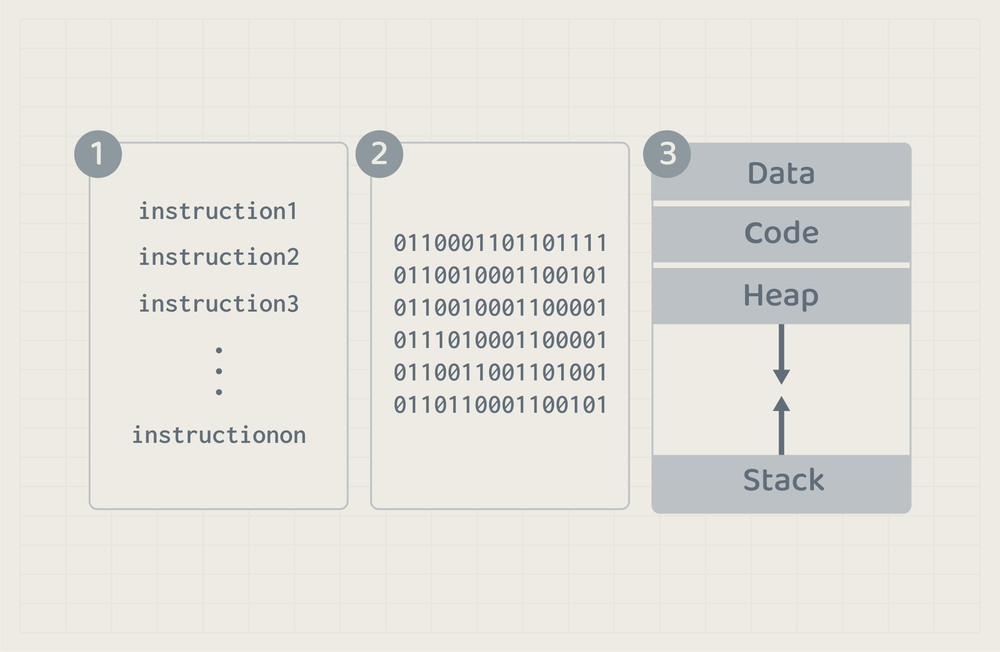

# Process Introduction

## Concept
A `process` is a program in execution. That means when a program is at run time, the program becomes a process. However, what is a program called before that? 

Program passes through 3 phases in its lifetime which are as follows:
1. Development phase: source code.
2. Compile phase: executable file. 
3. Run-time phase: a process.

When a program is executed, it is loaded in main memory as a process to be handled by the operating system, from execution to assigning resources. Once the process has completed its task, the operating system will free located memory addresses and resources from its use.

<!-- ### Process Viewer 
Let us have a look at Activity Manager program on MacOS. It is a program that displays an overall status of running programs (processes) and their execution. Let us search for Zoom as an example while running it. 

As you can see, Zoom exists as a process since it is currently running. If we terminated the process by clicking on zoom and choosing quit, the zoom process will terminate and zoom will no longer be running. 

> If you are using windows, use Task manager program. -->
### Process States 
Once the program is loaded into memory and become a process, it will have one of the following states.

process states:
- **New** - The process has just been created and it is at its initial state.
- **Ready** - The process is ready to be executed.
- **Running** - The CPU is working on this process's instructions.
- **Waiting** - The process can not run at the current time since it is waiting for an event or a resource to become available.
- **Terminated** - The process has finished.

All these states are used to manage and control processes efficiently.

### Process Tree
Every process is part of another process. If a running program (process) executed another program, the first one will be the parent of the second one. Processes relationship forms a tree data structure.

Let us have an example of running date program from the terminal, the terminal is a program that enables users to command the operating system. For example, creating and accessing files and directories.

Here is an example of running **date program** from the shell to display today's date. 

The terminal is a process that executed another process. Therefore, the terminal will be the parent process of date process. And the tree will look like the following. 

> Note: The root process is the first process that the computer runs, in unix-based OS, it is typically init process. 

### Processes and Syscalls
Operating systems manage pocesses using **syscalls**. There are some services provided by the operating system to create, manage, and control processes. 
In Unix-like systems, you can find the following syscalls for process management. 
1. **Process Creation**:
   - **`fork()`**: Creates a new process that is a copy of the calling process. The new process is called the child process.
   - **`exec()`**: it takes the current process and replaces it with a new program. This means the original program stops running, and the new program starts fresh in the same process.

2. **Process Termination**:
   - **`exit()`**: Ends the current process and sends a status code to the operating system, indicating how it finished (success or error).
   - **`kill()`**: Sends a signal to a process, which can be used to terminate it or interrupt its execution.

3. **Process Control**:
   - **`wait()`**: Makes a parent process pause until one of its child processes finishes running.
   - **`waitpid()`**: Similar to `wait()`, but allows the parent to wait for a specific child process to finish.

4. **Process Scheduling**:
   - The operating system uses scheduling algorithms to determine which processes run and for how long. Syscalls allow processes to yield control voluntarily or be interrupted based on priority.

5. **Interruption and Signals**:
   - **Signal Handling**: Allows processes to respond to events, like interruptions from the user or other processes. This is done using syscalls like signal().
   - **`pause()`**: Suspends the process until a signal is received.

6. **Process Information**:
   - **`getpid()`**: Returns the process ID of the calling process.
   - **`getppid()`**: Returns the parent process ID.

> Note: There are some differences between operating systems and their syscalls naming. For example, creating a process in Windows OS can be done using *CreateProcess()* syscall.

### Summary
We have introduced the concept of process for now, and we will delve into how to interact with the process using GUI, Command Line, and through the use of Programming Languages.
