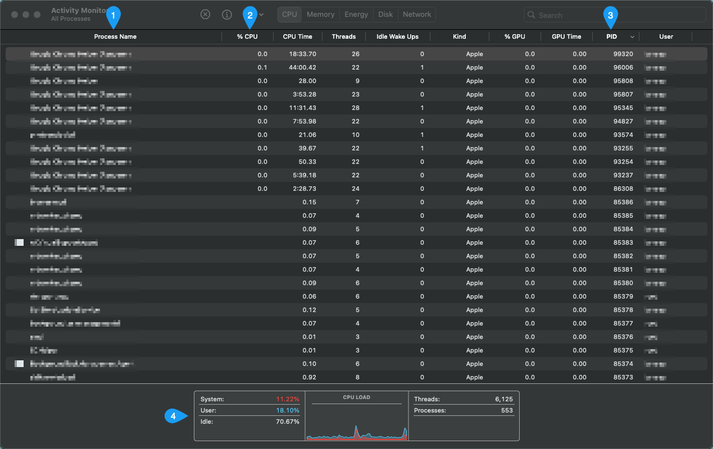
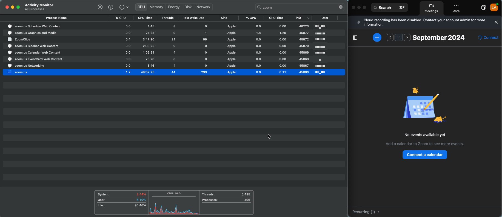
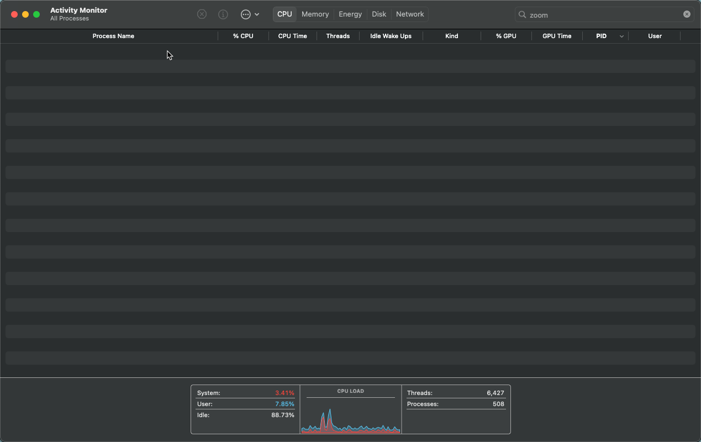
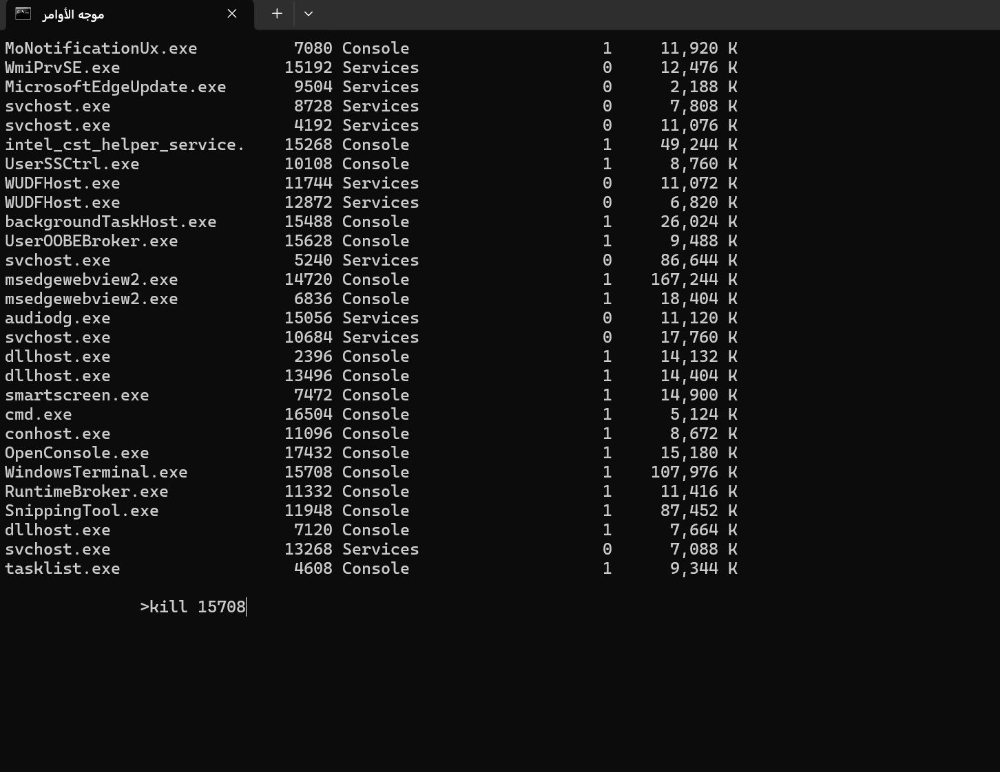

# Process Manager through GUI and Command Line
OS provides some services for programs or users to manage processes, such as creating, pausing, executing, or killing a process. To access these features we may use some libraries in our programming languages that communicate directly with the OS or even calling syscalls directly, or we can use the command line. In our case, we will demonstrate the concept of managing processes through GUI using **Activity Monitor** in MacOS or **Task Manager** in Windows OS. And using the command line. However, we will discuss how to manage processes using the libraries in programming languages later on.

> Note: Both ways of interaction uses **syscalls** provided by the operating systems to manage processes. 

## Activity Monitor 
It is a utility in MacOS devices that helps you analyze and manage processes and see their resource usage.

Above is an image of the activity monitor program, it displays the current activities of the computer including running programs (processes).
1. **Process Name**: is a list of all currently running programs.
2. **CPU**: is the CPU usage by each process. 
3. **PID**: each process is assigned to a process ID for identifying them.
4. **CPU Load**: is an overall current CPU state that identifies how much CPU is used and by whom. 

> Resource for [Activity Monitor](https://support.apple.com/en-sa/guide/activity-monitor/welcome/mac).

> Resource for [Task Manager](https://learn.microsoft.com/en-us/shows/inside/task-manager).

Let us open the Zoom program and search for it using the Activity Monitor. 

As you can see, when Zoom is running, there must be a process which was displayed in the image above. What do you think will happen if we close Zoom? 
The process must be terminated since the program is not running, let us terminate it and check again. 

> To quit Zoom, you can double-click on the process and choose quit. Or, close the program from the zoom itself.

## Command Line
Open your terminal on MacOS & Linux or command line prompt on Windows.

### MacOS & Linux
use the `top` command to display all the current processes and their data. 

To kill a process, you can use the `kill` command and provide it with the process ID. The following video demonstrates the complete process of displaying and terminating a process (we terminated the terminal process as an example)

https://github.com/user-attachments/assets/61a99668-59d3-4fa9-9caf-8d2fec915803

### Windows
For windows users, you can type `Tasklist` command to display all processes.

> Resource for [Tasklist command](https://ss64.com/nt/tasklist.html).

Here is an example of listing current processes and terminating the CMD process using the command line.

Once we kill the cmd process, the cmd window will be closed same as the MacOS video.

