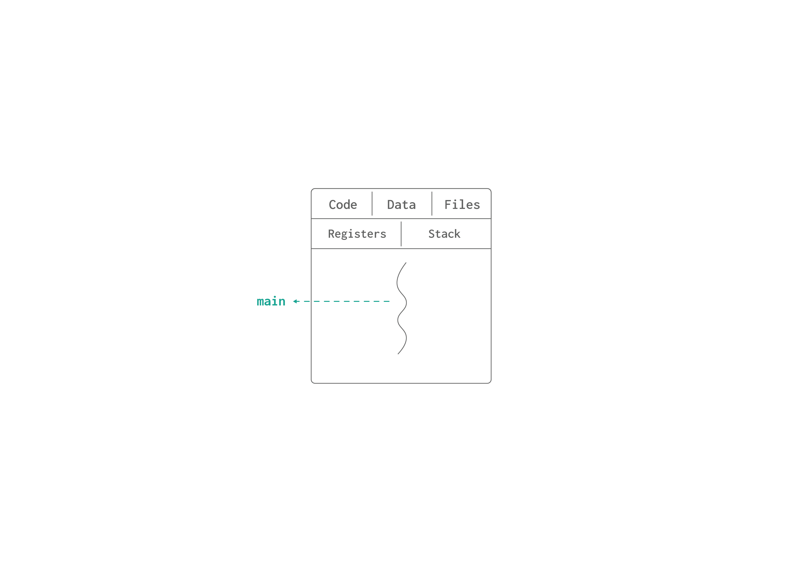
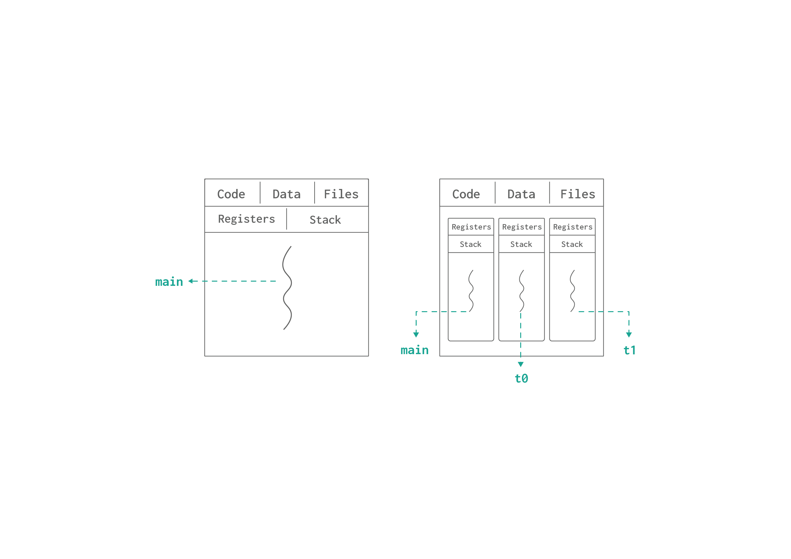

# Thread 


## Concept
Have you ever used a program running several tasks at the same time? for example, a music player plays the music and at the same time, it shows notifications and recommendations. All of these tasks happen concurrently not sequentially (depending on  the CPU cores). Also, the music player process does not utilize another process for other tasks but performs several tasks at the same time by itself. This can be achieved via threads. 

A `thread` is a unit of execution. Every process has at least one thread to get executed. You can think of the thread as an execution arrow that reads instructions one after the other.


Having more than one thread in a single process means more independent execution units that can run concurrently at the same time.

Threads are small execution units inside of a process, and they share some resources as described in the image below.




### Thread States
Threads go through a lifecycle that changes its state.

Thread states:
- **New**: A new thread have been created.
- **Ready**: the thread is simply ready for running.
- **Running**: the thread is currently running.
- **Waiting**: the thread is waiting for a specific event to execute.
- **Blocked**: the thread got blocked while running for a specific reason. For example, a sleep method have been executed, or it is waiting for an I/O device.
- **Dead/Terminated** : thread has been terminated.


## Code 
To create and manage threads in C, we will be using POSIX Threads (pthread) library as the following. 

First, lets create a program without any threads. If there is no thread created, it means there is only one, which is the main thread to execute the program instructions.

```c
#include <stdio.h>


int main(){
    printf("Hello from main thread\n");
    return 0;
}
```

output
```
Hello from main thread
```

Now, let's create a new thread (new execution flow) to print another statement which is `Hello from the new thread`. This can be done by first including the thread library, creating the thread, and then joining the thread with the main execution flow as the following. 

```c
#include <stdio.h>
#include <pthread.h>

//A function to be executed by thread1
void* print_msg(){
    printf("Hello from the new thread\n");
    return NULL;
}
int main(){
    pthread_t thread1; //Declares a variable for the thread identifier
    pthread_create(&thread1, NULL, print_msg, NULL); //Creates the new thread
    pthread_join(thread1, NULL); //Wait for thread1 to finish and then continue the execution
    printf("Hello from main thread\n");
    return 0;
}
```

output
```
Hello from the new thread
Hello from main thread
```

pthread_join() is a function that will join two threads together, in our case, it will wait for thread1 to execute and then continue the execution of the main thread. If we changed its position to after the main thread print message, the output of the program may change, since we don't require thread1 to finish before printing `Hello from main thread`.

```c
#include <stdio.h>
#include <pthread.h>

//A function to be executed by thread1
void* print_msg(){
    printf("Hello from the new thread\n");
    return NULL;
}
int main(){
    pthread_t thread1; //Declares a variable for the thread identifier
    pthread_create(&thread1, NULL, print_msg, NULL); //Creates the new thread
    printf("Hello from main thread\n");
    pthread_join(thread1, NULL); //Wait for thread1 to finish and then continue the execution
    return 0;
}

```

output
```
Hello from main thread
Hello from the new thread
```

The `pthread_create` takes several arguments, which are:
- Thread ID: A place to store the unique ID of the new thread.
- Attributes: Optional settings for the thread (like stack size). You can use default settings by passing `NULL`.
- Function: The function that the new thread will run. It must take one argument and return a value.
- Argument: The data you want to send to the thread's function. You can pass NULL if you don't need to send anything.

You can also print the thread id using the variable we created as the following. 

```c
#include <stdio.h>
#include <pthread.h>

//A function to be executed by thread1
void* print_msg(){
    printf("Hello from the new thread\n");
    return NULL;
}
int main(){
    pthread_t thread1; 
    pthread_create(&thread1, NULL, print_msg, NULL); 
    printf("Hello from main thread\n");
    printf("thread id: %lu \n", (unsigned long)thread1); //Print thread1 id
    pthread_join(thread1, NULL); 
    return 0;
}
```

output
```
Hello from main thread
thread id: 6122795008 
Hello from the new thread
```

>Note: you can print the current thread id using pthread_self();
<!-- ### Create a thread with passing arguments to functions -->


### More examples in Java
To handle threads in Java, we will be working with the `Thread` class and its related classes and interfaces to create, read, and delete threads.


#### Create Thread

You can create a new thread by two ways. 
- Extending `Thread` class
```java
public class CreateThread1 {
    
    public static void main(String[] args) {
        Multithreading t0 = new Multithreading();
        t0.start();
    }
}

class Multithreading extends Thread{
    @Override
    public void run() {
        System.out.println( "Thread is running");
    }
}

```

> By extending the `Thread` class, you can use its methods such as `start()` to run the thread after creating it. Otherwise, the thread will not start running.

- Implementing `Runnable` interface
```java

public class CreateThread2 {
    
    public static void main(String[] args) {
        Multithreading runnableThread = new Multithreading();
        Thread t0 = new Thread(runnableThread);
        t0.start();
    }
}

class Multithreading implements Runnable{
    @Override
    public void run() {
        System.out.println( "Thread is running");
    }
}


```

There is a shortcut to implement an interface in Java without the effort to create a class as the following.
```java
public class CreateThread2 {
    
    public static void main(String[] args) {
        
        Thread t0 = new Thread(new Runnable() {
            @Override
            public void run() {
                System.out.println( "Thread is running");
            }
        });
        t0.start();
    }
}

```

#### Read Thread
Every process has at least one thread running (main). Let us first print the current running thread in a java program. 

```java
public class ReadThread1 {
    
    public static void main(String[] args) {
        System.out.println(Thread.currentThread().getName()); //output: main
    }
}
```
To create another thread and read it, you can use the Thread class methods such as `getName()`.
```java
public class ReadThread2 {
    
    public static void main(String[] args) {
        Multithreading t0 = new Multithreading();
        t0.start();
    }
}

class Multithreading extends Thread{
    @Override
    public void run() {
        System.out.println( "Thread " + this.getName() + " is running");
    }
}

```

output
```
Thread Thread-0 is running
```

#### Terminate Thread

```java
public class TerminateThread {
    
    public static void main(String[] args) throws InterruptedException {
        Multithreading t0 = new Multithreading();
        t0.start();
        System.out.println(t0.getState());
    }
}

class Multithreading extends Thread{
    @Override
    public void run() {
        System.out.println( "Thread " + this.getName() + " is running");
    }
}

```

output
```
RUNNABLE
Thread Thread-0 is running
```
As you can see, the RUNNABLE state was printed then the thread was executed. It did not terminate since the the time the print statement was executed the thread was ready for execution hence RUNNABLE. Let's wait for 3 seconds before printing the thread state now.

```java
public class TerminateThread2 {
    
    public static void main(String[] args) throws InterruptedException {
        Multithreading t0 = new Multithreading();
        t0.start();
        t0.sleep(3000);
        System.out.println(t0.getState());
    }
}

class Multithreading extends Thread{
    @Override
    public void run() {
        System.out.println( "Thread " + this.getName() + " is running");
    }
}

```

output
```
Thread Thread-0 is running
TERMINATED
```

we have given the thread the time to execute and terminate before printing its state. Therefore the current state of the thread is terminated.

## Resources
- [Threads in C](https://www.youtube.com/watch?v=ldJ8WGZVXZk)
- [Runestone Academy](https://runestone.academy/ns/books/published/javajavajava/thread-statesand-life-cycle.html)
## Projects
- [Thread project](https://github.com/SAFCSP-Team/thread-project)
