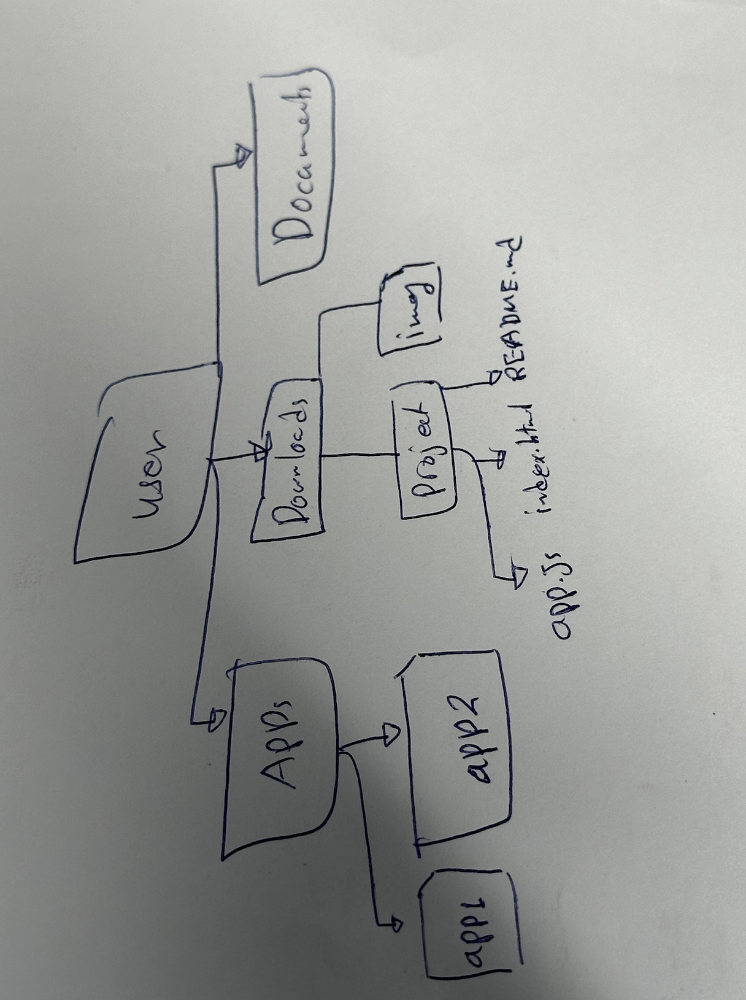

# Introduction 
**Everything in a computer is stored as a file**. The long-term storage device in a computer, such as a hard disk drive (HDD) or solid-state drive (SSD), stores files permanently. The disk organizes files in directories, which can be visualized as a tree data structure. 

Files can include normal text files, images, and executable files (which are programs).

[image of file hierarchy]


> Note: Even though files are considered the primary unit of storing data in computers, at a fundamental level, all data in a computer, whether it’s a program, image, or document, is represented as binary data (0s and 1s). This data is stored in files.


Operating systems allows us to manage files by providing us with a list of services (syscalls) to read, write, delete, and updated files and directories. 

Example of file management syscalls,
- open()
- write()
- read()
- close()


## File System 
A file system is the software that manages file storage in a computer. It typically operates at the level of the operating system, serving as an integral part of the OS. Its primary functions include storing, organizing, and accessing data in files, enabling users and applications to efficiently interact with their data. The file system defines how files are named, how they are organized into directories, and how permissions and access control are managed.

The file system stores the following **information** of a file. 
- **File**, which contains the actual data stored. 
- **Directory**, which is used to structure files and organize them.
- **Path**, which is the way to specify the location of a file.
- **File Attribute/Metadata**, which can be used to understand how to interact with the file (such as reading or writing). Examples of metadata is the size, permissions, or the creation and last modification dates.
- **File Naming Rules**, which can be used to govern how to name files in the computer. 


It also provide the following **functionalities**.

- **Storage Management**, organizes and allocates space on storage devices.
- **File Accessing**, which is done by providing methods for reading, writing, deleting, or updating files. 
- **Data Integrity**, which ensures data reliability.
- **Access Control/Security**, by managing permissions and access rights.
- **File Organization**, organizes files for easier retrieval. It can be done using data structures to organize and access file efficiently.


## Project 
Create a copy of `file.txt` file and name it `copy.txt` using C programming language. 

`file.txt` content
```
Hello developer! Try to copy me.
```